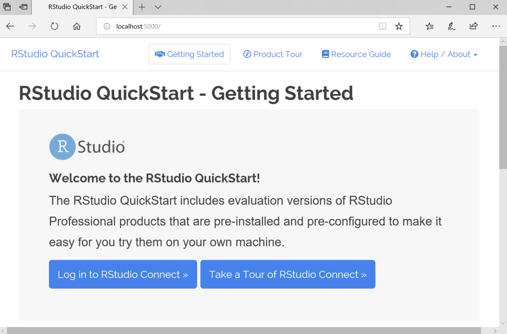

<blockquote>

<em>This blog post is outdated. Please see our [product page](https://posit.co/products/enterprise/connect/) to learn how to try Posit Connect.
</em>

</blockquote>

Have you heard of RStudio Connect, but do not know where to start? Maybe you are
trying to show your manager how Shiny applications can be deployed in
production, or convince a DevOps engineer that R can fit into her existing
tooling. Perhaps you want to explore the functionality of RStudio's Professional
products to see if they fit the needs you have in your work.

Today, we are excited to announce the RStudio QuickStart, which allows you to
try out RStudio Connect for free from your desktop.

In many organizations, we find that R is already being used internally by
individual data scientists and analysts for productive work on their desktops.
For other organizations, R has been chosen as a standard for analytics and data
science, but a process of exploration is necessary to understand what adoption
of open source software looks like in the enterprise.

In all cases, we recommend users showcase our full server-side products to show
how R can be useful across a team or department, rather than on a single user's
machine. Furthermore, this process integrates R into an organization's IT practices
and secures it as an analytic standard. The QuickStart is a great first step
towards this objective because it is free, easy, and comes pre-populated with
some of the most common workflows that we see in enterprise use of our software.

To get started with your 45-day free evaluation, visit the [RStudio
QuickStart](https://www.rstudio.com/products/quickstart/) page for instructions.
You should download and run the QuickStart and take the product tour. Discuss
on [RStudio Community](https://community.rstudio.com/tags/c/r-admin/quickstart) or [Contact our sales team](mailto:sales@rstudio.com)
throughout your exploration if you have difficulties or questions about next steps!

* Visit the [QuickStart page](https://www.rstudio.com/products/quickstart/)
* Download and run the QuickStart, then take the product tour
* [Contact us](mailto:sales@rstudio.com) to help you set up RStudio Professional software on your production
infrastructure

> RStudio provides free and open source tools for data science and
enterprise-ready professional software for teams to develop and share their work
at scale. Now you can try out RStudio professional software on your desktop for
free!

