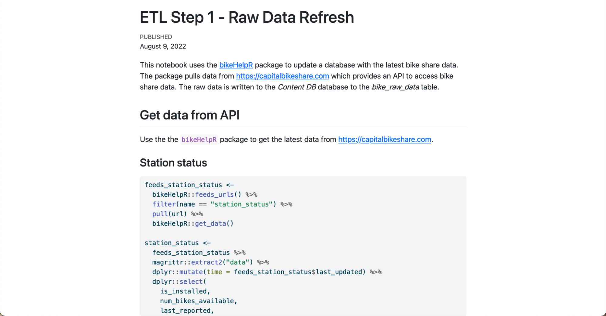
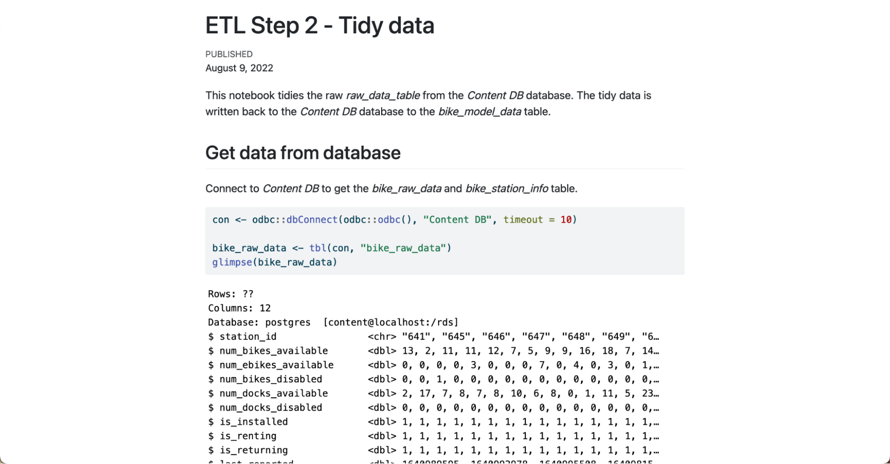
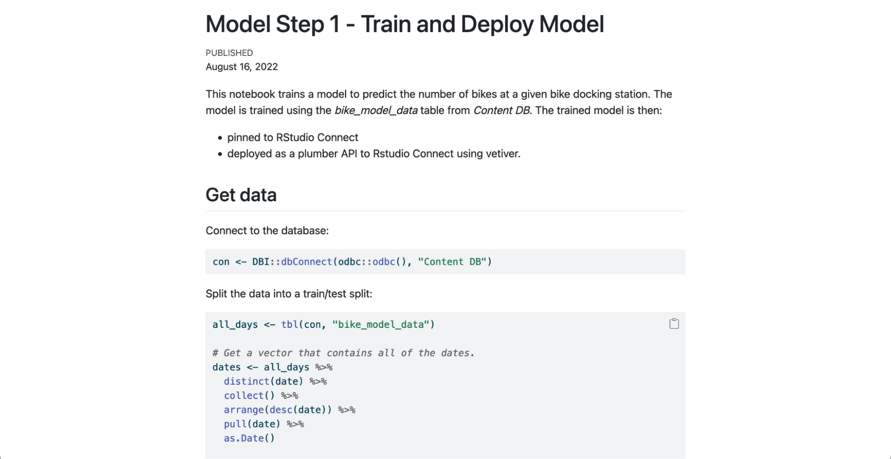
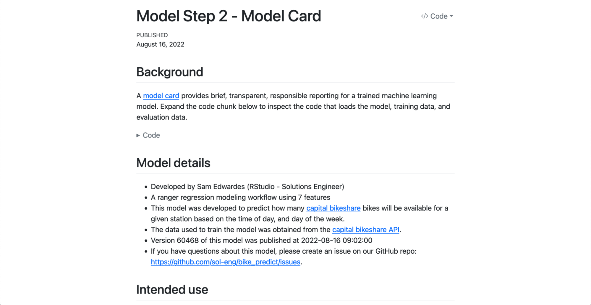
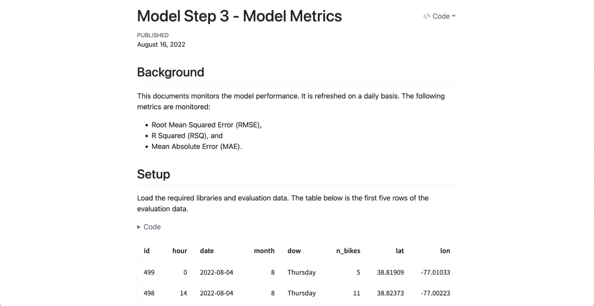
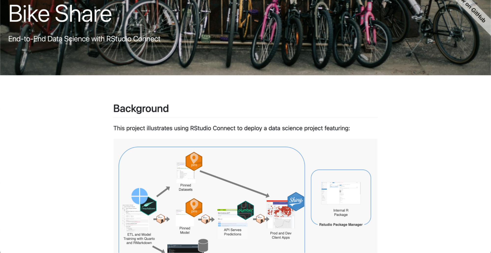
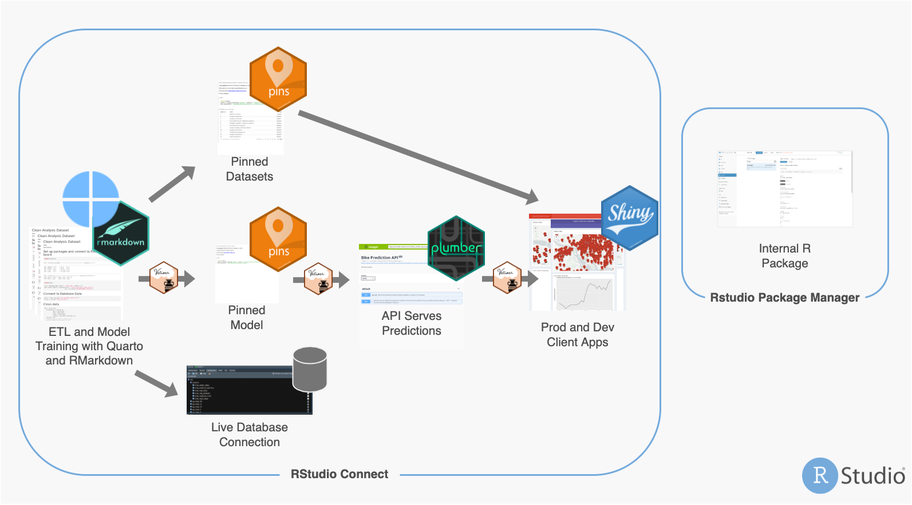

Machine learning operations (MLOps) are a set of best practices for running machine learning models successfully in production environments. Data scientists and system administrators have expanding options for setting up their pipeline. However, while many tools exist for preparing data and training models, there is a lack of streamlined tooling for tasks like putting a model in production, maintaining the model, or monitoring performance.

Enter <a href="https://vetiver.rstudio.com/" target = "_blank">vetiver</a>, an open-source framework for the entire model lifecycle. Vetiver provides R and Python programmers with a fluid, unified way of working with machine learning models.

Our Solutions Engineering team developed a <a href="https://shiny.rstudio.com/" target = "_blank">Shiny</a> app for Washington D.C.’s <a href="https://www.capitalbikeshare.com/" target = "_blank">Capital Bikeshare</a> program a few years ago. This app provides real-time predictions of the number of bikes available at stations across the city. The end-to-end machine learning pipeline feeding the app uses R to import and modify data, save it in a <a href="https://pins.rstudio.com/" target = "_blank">pin</a>, develop a model, then move the model to a deployable location. Alex Gold <a href="https://www.rstudio.com/resources/rstudioconf-2020/deploying-end-to-end-data-science-with-shiny-plumber-and-pins/" target = "_blank">delivered a presentation</a> on this workflow in 2020.

Sam Edwardes <a href="https://solutions.rstudio.com/example/bike_predict/" target = "_blank">updated the project</a> to apply Quarto and the new vetiver framework. Previously, we used R Markdown and a combination of one-off functions and scripts for each MLOps task. Using the latest from RStudio:

* <a href="https://quarto.org/" target = "_blank">Quarto</a> provides a refreshed look and language-agnostic tool for computational documents. Like R Markdown documents, the Quarto documents are available on <a href="https://www.rstudio.com/products/connect/" target = "_blank">RStudio Connect</a>.
* The pipeline now uses vetiver to train, pin, monitor, and deploy the model.
    * This streamlines the code and makes the MLOps pipeline easier to maintain.
    * By using vetiver across the organization, we have a consistent way to perform MLOps tasks.
    * Deploying the model as an API endpoint using vetiver allows us to reuse the machine learning model for other apps or use cases.

We will walk through the updated pipeline below. To see the entire project, check out the <a href="https://solutions.rstudio.com/example/bike_predict/" target = "_blank">Bike Predict page on solutions.rstudio.com</a>.

## Building A Predictive Web App With Shiny

The Shiny app predicts the number of bikes at a station in the near future based on real-time streaming data from an API. The steps involved are:

* Write the latest station status data from the <a href="https://capitalbikeshare.com" target = "_blank">Capital Bikeshare</a> API to a database
* Join the station status data with the station information dataset and tidy the data
* Train the model using this tidied dataset
* Save and version the model to Connect as a pin using vetiver
* Use the vetiver model card template to document essential facts and considerations of the deployed model
* Use functions provided by vetiver to document and monitor model performance
* Use the API endpoint to serve predictions to a Shiny app interactively
* Make the Shiny app available to anybody interested in the predictions

The project shows an exciting set of capabilities, combining open source with RStudio's professional products.

* <a href="https://www.rstudio.com/products/workbench/" target = "_blank">RStudio Workbench</a> is a centralized, server-based environment for working with code.
* <a href="https://www.rstudio.com/products/connect/" target = "_blank">RStudio Connect</a> publishes and schedules data science assets like pins, APIs, and Quarto reports.
* <a href="https://www.rstudio.com/products/package-manager/" target = "_blank">RStudio Package Manager</a> (RSPM) controls and distributes packages throughout an organization.

## Creating An End-to-End Machine Learning Pipeline

**1. Create a custom package for pulling data**

<a href="https://www.google.com/search?client=firefox-b-1-d&q=capital+bikshare+api" target = "_blank">Capital Bikeshare has an API</a> that publishes real-time system data. We created a set of helper functions for pulling the data. To increase efficiency, we wanted to reuse and share these functions.

For that, we created the <a href="https://github.com/sol-eng/bikeHelpR" target = "_blank">bikehelpR</a> package to house, document, and test the functions we used. To deploy the package, we used RSPM. RSPM makes it easy to create a package and have it available via `install.packages()` for everybody on our team.

**2. Extract, transform, load process in R**

The first step of the pipeline pulls the latest data from the Capital Bikeshare API using the bikehelpR package. We write the raw data to the Content Database’s _bike_raw_data_ and _bike_station_info_ tables. 

The station info is also written to a pin. This pin will be accessed by the Shiny app so that it can extract the bike station info without connecting to the database. Read more about “production-izing” <a href="https://rviews.rstudio.com/2019/10/17/deploying-data-with-pins/" target = "_blank">Shiny with pins</a>.

<a href="https://colorado.rstudio.com/rsc/bike-predict-r-raw-data-refresh/" target = "_blank">ETL Step 1 - Raw Data Refresh Quarto Document</a>

**3. Tidy and join datasets**

We tidy the _bike_raw_data_ table using <a href="https://www.tidyverse.org/" target = "_blank">tidyverse</a> packages. Then, we join it with the _bike_station_info_ table and write the output into the Content Database’s _bike_model_data_ table.

<a href="https://colorado.rstudio.com/rsc/bike-predict-r-tidy-data/document.html" target = "_blank">ETL Step 2 - Tidy Data Quarto Document</a>

**4. Train and deploy the model**

We use the _bike_model_data_ table to train and evaluate a random forest model. The model is saved to RStudio Connect as a pin (using vetiver) and then it is converted into an API endpoint (also using vetiver). By using vetiver to pin and deploy our model, we ensure a consistent approach across the organization for how we pin, version, and deploy machine learning models. Then, we deploy the API to RStudio Connect.

<a href="https://colorado.rstudio.com/rsc/bike-predict-r-train-and-deploy-model/document.html" target = "_blank">Model Step 1 - Train and Deploy Model</a>

**5. Create a model card**

Next, we evaluate the training and evaluation data using various methods. Vetiver’s <a href="https://dl.acm.org/doi/10.1145/3287560.3287596" target = "_blank">model card</a> template helps document essential facts and considerations of the deployed model.

<a href="https://colorado.rstudio.com/rsc/bike-predict-r-model-card/document.html" target = "_blank">Model Step 2 - Model Card</a>

**6. Monitor model metrics**

We can document model performance using vetiver and write the metrics to a pin on RStudio Connect. With these functions, we can monitor for model performance degradation. Using vetiver to monitor model performance again ensures a consistent approach to model governance across teams.

<a href="https://colorado.rstudio.com/rsc/bike-predict-r-model-metrics/document.html" target = "_blank">Model Step 3 - Model Metrics</a>

**7. Deploy a Shiny app that displays real-time predictions**

We use the API endpoint to serve predictions to a Shiny app interactively. Clicking on a station shows us a line graph of the time and predicted number of bikes.

<a href="https://colorado.rstudio.com/rsc/bike-predict-r-client-app/" target = "_blank">Link to Shiny App</a>

**8. Create project dashboard**

This project is composed of many different tasks. We wanted a single place to share the full context and content with others. We created a dashboard made with <a href="https://rstudio.github.io/connectwidgets/" target = "_blank">connectwidgets</a> to link to the entire project. This makes it easy for anybody new to the Bike Share app to understand its purpose and steps involved.

<a href="https://colorado.rstudio.com/rsc/bike-predict-r-dashboard/document.html" target = "_blank">Link to Dashboard</a>

See the entire updated pipeline here:

## Learn More

We hope that you enjoyed this example of using vetiver, pins, and RStudio Connect to create an end-to-end machine learning pipeline. Folks in machine-learning-heavy contexts can use vetiver to streamline their work and easily “production-ize” content.

* Review the Bike Share pipeline code on <a href="https://github.com/sol-eng/bike_predict" target = "_blank">GitHub</a>.
* Check out this project and other RStudio product workflows on <a href="https://solutions.rstudio.com/example/bike_predict/" target = "_blank">solutions.rstudio.com</a>.

Join Julia Silge and Isabel Zimmerman to learn more about MLOps with vetiver in Python and R at the <a href="https://www.youtube.com/watch?v=oFQANK13-k4" target = "_blank">RStudio Enterprise Meetup on September 20th</a>!

<a class="btn btn-primary" href="https://www.addevent.com/event/In13519032" target="_blank">Add the event to your calendar</a>

