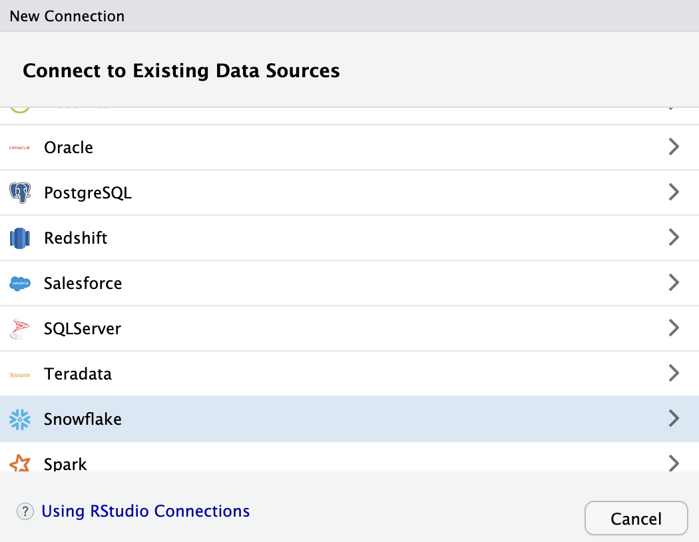
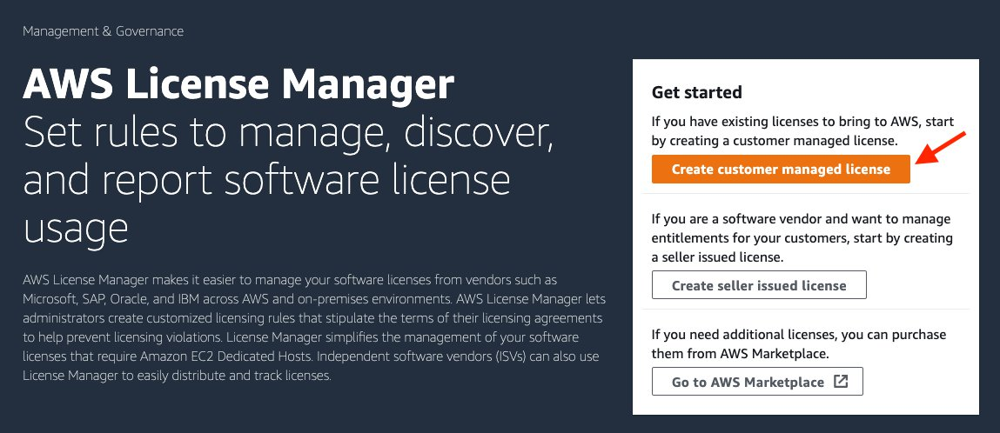

On December 6th, 2021, the <a href="https://www.meetup.com/RStudio-Enterprise-Community-Meetup/" target = "_blank">RStudio Enterprise Community Meetup</a> hosted an event, Using RStudio on Amazon SageMaker.

In the meetup, James Blair covered:

1. Setting up <a href="https://www.rstudio.com/products/workbench/" target = "_blank">RStudio Workbench</a> on SageMaker
2. A use case for training a model and deploying to SageMaker
3. Using that model from a Shiny app that was then published to <a href="https://www.rstudio.com/products/connect/" target = "_blank">RStudio Connect</a>

The presentation was followed by questions and answers (Q&A) with both the RStudio and Amazon SageMaker teams. The Q&A below includes both questions that were answered during the event and those that we were unable to answer live.

We’ve grouped the questions below into buckets for organizational purposes:

* [General RStudio/SageMaker questions](#general-rstudiosagemaker-questions)
* [SageMaker-specific questions](#sagemaker-specific-questions)
* [Infrastructure questions](#infrastructure-questions)
* [Questions about connecting to data and other tools](#questions-about-connecting-to-data-and-other-tools)
* [Questions specific to modeling](#questions-specific-to-modeling)
* [Questions about environment management](#questions-about-environment-management)
* [Pricing and license management questions](#pricing-and-license-management-questions)
* [Questions about Shiny and RStudio Connect](#questions-about-shiny-and-rstudio-connect)
* [Helpful Links](#helpful-links)

Watch a snippet from the Meetup below:

Full meetup recording on <a href="https://www.youtube.com/watch?v=fmgSVRWgXDg" target="_blank"> YouTube</a>.

If you have questions about setting this up at your own organization, you can schedule time to talk with the RStudio team on <a href="https://rstudio.chilipiper.com/book/schedule-time-with-rstudio" target = "_blank">our booking system</a>.

## Meetup Q&A:

### General RStudio/SageMaker questions

**What are the differences between RStudio on SageMaker the R kernel in SageMaker Studio?**

**James Blair:** Functionality-wise, there's not going to be much of a difference in terms of what you can or can’t do or what types of workflows are or aren't supported. It comes down to just a preference. If you’re comfortable using the R kernel in the native Jupyter style environment, then you can interact with your environment that way.

One of the main motivating factors behind this integration has been that many R users have come to SageMaker and said we’d love to have RStudio because it's familiar. We feel comfortable and have fewer barriers to entry when we’re using that environment. So, it’s just an environmental preference.

### SageMaker-specific questions

**Will RStudio be available in the new Amazon SageMaker Studio Lab?**

As it stands today, Amazon SageMaker Studio Lab only comes with JupyterLab support, but please let your SageMaker representative know if that would be something that would be valuable to you. We will take into consideration where the service goes in the future.

**Can you also send jobs to AWS via the future package from SageMaker?**

At this time, there isn’t any tooling that makes it possible to send jobs to AWS via the future package from within SageMaker.

**Is interoperability the same with SageMaker Studio as well? If yes, are there any further benefits when it comes to editor selection that we can opt for?**

Interoperability between SageMaker Studio and RStudio is achieved through the attached EFS storage. Each user has their own EFS storage that is common and persistent across IDEs. This means that a user may start working on a project using R on RStudio to analyze the data and then switch to SageMaker Studio to use Tensorflow in Python to build their deep learning model. Additionally, interoperability from within RStudio can be accomplished using the <a href="https://rstudio.github.io/reticulate/" target = "_blank">reticulate</a> R package to interact with both R and Python.

**How does SageMaker help put machine learning (ML) solutions designed with R into production? Is there any specific ML package that SageMaker can deal with (e.g., tidymodels, caret)?**

**James Blair:** When you interact directly with SageMaker, most of the functionality is going to come through that SageMaker Python SDK. Like in the demo, we used reticulate, brought that module in, and then we applied methods and functions from that module to manipulate, train, and deploy a model. 

One of the underlying components of that is the fact that the whole process — the model training, tuning, deployment processes — are all actually happening in Python while being managed from R with reticulate. The container that we ran in the demo was running XGBoost and interacting with that via Python.

There is support in SageMaker for being able to define custom containers and images for model, training, and deployment where you could define ways to interact with R processes. To my understanding today, there’s not a lot of native R tooling there yet. However, this is something I’d love to see change and am hopeful will change over time as this partnership continues to grow.

**Michael Hsieh:** I’d like to add on to that SageMaker’s managed training and processing that you can access with SageMaker SDK is built with container technology. That means that you can bring in a container that has your package dependency to run it on SageMaker’s managed infrastructure. You can put your tidymodels or caret libraries into a container and start your training. You can also host your models built natively within RStudio into SageMaker and do all the ML Ops, along with SageMaker using the SageMaker SDK within your R environment. We do have a couple of examples showing how to do so:

* <a href="https://github.com/aws-samples/reinvent2020-aim404-productionize-r-using-amazon-sagemaker" target = "_blank">Training a forecasting model with fable in RStudio and SageMaker</a>
* <a href="https://github.com/aws-samples/amazon-sagemaker-statistical-simulation-rstudio" target = "_blank">Statistical simulation in RStudio and SageMaker</a>

Note that the material above uses open-source RStudio. The use of SageMaker SDK with reticulate remains identical in RStudio on Amazon SageMaker.

### Infrastructure questions

**How large is the automatically mounted home directory? Is it a user-specific or shared directory?**

The home directory is an EFS storage that can scale automatically to petabyte sizes. You can read here about the service: <a href="https://aws.amazon.com/efs/faq/" target = "_blank">Amazon EFS FAQs</a>.

The home directory is hosted on Amazon EFS and you can access it as you do with other EFS storage. For instance, if you mount this EFS to an ec2 instance with the appropriate permissions you would be able to access the files in your home directory.

When in SageMaker Studio/RStudio, each user has their own EFS storage, isolated from other users.

**Is RStudio Workbench fully on SageMaker? Or is it using SageMaker as a Launcher backend, which would still require a frontend Workbench server?**

**James Blair:** When you set up your SageMaker domain to support RStudio, one of the things that you do is identify a persistent instance that will host RStudio. There does need to be some persistent environment that runs and launches those sessions into SageMaker and allows SageMaker to manage the resources behind those sessions. 

That environment gets automatically provisioned for you when you set this up inside your SageMaker domain and you can decide what instance type you want. I think T3 Medium is the default, it doesn’t have to be very big because there’s no computation happening there.

**Georgios Schinas:** Yes, it’s a T3 Medium instance type and is also provided for free as part of the RStudio offering on SageMaker.

**Any information on when we can expect integration with CloudFormation/CDK? We strive for a strict IaaS solution in our company.**

We currently cannot estimate when this feature will be released but we are aware that this is something that our customers want. Please reach out to your AWS representative to let them know of this request and they will make sure to update you with news and details on this.

**Will there be fluid integration with Redshift? I'm thinking IAM authentication that mainly uses the user profile role.**

The user on RStudio is already authenticated with the role attached to the user and can access the rest of the AWS resources based on the roles’ IAM permissions. The easiest way to access these would probably be by using reticulate and boto3.

The default Docker image on SageMaker comes with the <a href="https://docs.rstudio.com/pro-drivers/" target = "_blank">RStudio Professional Drivers</a> pre-installed, so you can also connect to Redshift via ODBC.

**Regarding the home directory in RStudio Workbench: Is the home directory accessible via Amazon/AWS block storage (EBS) as well?**

The home directory is an EFS volume, so not an EBS volume. However, you can still mount the EFS volume to some other instance to access the data if this is required, similar to how you would do with an EBS. 

### Questions about connecting to data and other tools

**Can I use the Athena ODBC driver to run Athena queries from RStudio on SageMaker?**

The default Docker image on SageMaker comes with the RStudio Professional Drivers pre-installed, which includes an ODBC driver for Athena. You can use this driver in connection with the <a href="https://db.rstudio.com/r-packages/dbi/" target = "_blank">DBI</a> and <a href="https://db.rstudio.com/r-packages/odbc/" target = "_blank">odbc</a> R packages to run Athena queries from RStudio on SageMaker.

**Can I share files with others from my RStudio project in SageMaker?**

Currently, this functionality is not available from RStudio. Instead, you may want to consider using Git for code sharing or S3 for large file sharing and collaboration.

**Can I use sparklyr with EMR from RStudio on SageMaker?**

Currently, this functionality is not natively available. However, you can manually install all the necessary packages and configurations to use this library and connect to an EMR from RStudio, similar to how you would currently do on a self-managed RStudio instance.

**Would I connect to Snowflake and query within RStudio Workbench, launching from SageMaker in the same way as when it is not on SageMaker?**

The Snowflake ODBC driver is included in the default Docker image for RStudio on SageMaker. You can use this ODBC driver in combination with the DBI and odbc R packages to connect to and query Snowflake from RStudio on SageMaker.

### Questions specific to modeling

**Would anything different need to be done to parallelize model training done with tidymodels that is different from what would be done outside of SageMaker?**

You can continue using the tooling of your choice (including tidymodels) when running RStudio on SageMaker, similar to how you were doing before.
Currently, there is no functionality in tidymodels to take advantage of SageMaker-specific resources. However, within SageMaker you can define your custom training container to run training jobs in parallel.

**Does any connector exist to interface with the tidymodels ecosystem?**

Currently, there is no native connector available, but you can continue using the tooling of your choice when running RStudio on SageMaker, similar to how you were doing before. This means that you can use tidymodels within RStudio on SageMaker, but all execution will be local to the session running in SageMaker.

### Questions about environment management

**What are the expectations for environment management? Managed by AWS? RStudio? Me? Will I have access to the same environment two years from now to maintain reproducibility?**

**James Blair:** I think there may be two sides to this question because "environment" can mean a couple of things. 

For packages, your local R environment is within your control, so if you want, you can install packages and those will go into your home directory. That home directory is persistent, so different sessions that start will have the same access to the same files and packages that you were working with previously. There's automatic support for this, so if you wanted to create a very specific collection of packages for a very specific project and have a very specific set of versions, that's supported through tools like <a href="https://rstudio.github.io/renv/articles/renv.html" target = "_blank">renv</a>. (You can also configure this to work with <a href="https://www.rstudio.com/products/package-manager/" target = "_blank">RStudio Package Manager</a>, which mitigates issues by managing the package repository centrally for your organization so that data scientists can install packages quickly and securely, and ensure project reproducibility and repeatability.)

In combination with what you're getting out of SageMaker, your local environment is totally within your control and certainly, you can set it up so that you can come back to that environment two years down the road and continue working from where you left off.

**Amazon SageMaker team:** You can install packages as you would normally do now. Further to this, the packages are installed on your "personal" EFS storage (persistent storage) and will be available in future/other sessions as well.

**James Blair:** The other side of this is the administrative environment, like the server and settings for RStudio Workbench, which falls under SageMaker’s control. If you say, I’m going to set up and manage RStudio Workbench through SageMaker, part of what you’re doing is saying, I'm going to let SageMaker handle the RStudio administrative tasks for me, which can be a huge benefit because you don’t have to worry about that anymore.

This also means that I’m letting SageMaker handle that for me, so if there are questions or concerns or things that I want to adjust there, or features I want to be enabled, then that becomes a conversation to have with SageMaker.

We at RStudio are excited to see how this helps a lot of organizations that we work with who are very Windows-centric. Our software is Linux-based and sometimes that is a hurdle to overcome for organizations.

Regarding the system libraries component, when you’re running your session on SageMaker, you have root access to that container, so when you go into the Terminal tab of RStudio you can modify that container as you need. If there's a system dependency that you need, you should be able to get in and add it to that container at that time. That's not persistent though, so if the session terminates and that container goes away, you're going to have to reinstall that dependency at that point. The other side is this custom image functionality that we anticipate coming to SageMaker in the near future, which would allow you to identify at the Docker level what system dependencies you need available in your environment and that's how you would manage those persistently.

**Amazon SageMaker team:** This integration is designed to be a fully managed environment, the expectations for management are outlined in the AWS documentation here: <a href="https://docs.aws.amazon.com/sagemaker/latest/dg/rstudio.html" target = "_blank">RStudio on Amazon SageMaker</a>.

**Can you limit or control which package versions or installations are available via Package Manager?**

**Amazon SageMaker team:** You can install packages as you would normally do now. Further to this, the packages are installed on your "personal" EFS storage (persistent storage) and will be available in future/other sessions as well.

When you set up your SageMaker domain with RStudio, you are prompted to input a URL for RStudio Package Manager. If you are maintaining your own installation of RStudio Package Manager, you can provide the URL during this setup process and it will be set as the default package repository for all RStudio users.

### Pricing and license management questions

**Once I have a license of Workbench, will it automatically show in SageMaker or does it require any migration steps?**

To use RStudio on SageMaker, you need to bring your RStudio license to License Manager by completing the following steps:

1. If you don’t have an RStudio Workbench license, you can purchase one on RStudio Pricing or by contacting RStudio Sales (<a href="mailto:sales@rstudio.com">sales@rstudio.com</a>).

2. To add RStudio on SageMaker to your existing RStudio Workbench Enterprise purchase, or to convert an RStudio Workbench Standard license to SageMaker, contact your RStudio Sales Representative (<a href="mailto:sales@rstudio.com">sales@rstudio.com</a>), who will send you the appropriate electronic order form.

3. RStudio grants your RStudio Workbench licenses to your AWS accounts through License Manager in the U.S. East (N. Virginia) Region. You can expect the license grant process to be completed within 3 business days after you share the AWS account IDs with RStudio.

4. After the license is granted, you receive notification from RStudio with instructions to log in to the License Manager console's Granted Licenses page in the U.S. East (N. Virginia) Region to accept the license grant.

5. If this is your first time using License Manager, choose "Create customer managed license".

You can find additional details here: <a href="https://aws.amazon.com/blogs/machine-learning/get-started-with-rstudio-on-amazon-sagemaker/" target = "_blank">Get started with RStudio on Amazon SageMaker</a>.

**Do we have to pay for two instances, one for RStudio Workbench, and one for RSession (at minimum) per user?**

The RStudio Workbench server will by default be running on a ml.t3.medium instance, which will be provided for free. In case this instance type is changed, then charges will be incurred based on the instance type. RSessions are also charged based on instance type/size. 

**Do you need a paid RStudio Workbench license to use RStudio in SageMaker?**

Yes. RStudio on Amazon SageMaker is a paid product and requires that each user is appropriately licensed. Amazon SageMaker does not sell or provide RStudio licenses. RStudio on Amazon SageMaker requires a separate product license from RStudio. To elaborate on that a bit further, you could have either RStudio Workbench Standard — which is licensed for one server activation — or Enterprise, which gives you unlimited server activations. If you have RStudio Workbench Standard, then SageMaker becomes your one installation of RStudio. If you have RStudio Workbench Enterprise, you could be running RStudio and SageMaker, as well as your own separate on-prem solution. You have a lot of flexibility at that point.

For current customers of RStudio Workbench Enterprise, licenses are issued at no additional cost. Read more here: <a href="https://docs.aws.amazon.com/sagemaker/latest/dg/rstudio-license.html" target = "_blank">RStudio license</a>.

**A basic RStudio Workbench license includes 5 seats; does each user then have the ability to spin up their own separate instance with separate memory?**

Yes, here is an overview of functionality from the data scientist's perspective: <a href="https://aws.amazon.com/blogs/aws/announcing-fully-managed-rstudio-on-amazon-sagemaker-for-data-scientists/" target = "_blank">Announcing Fully Managed RStudio on Amazon SageMaker for Data Scientists</a>.

### Questions about Shiny and RStudio Connect

**Is this a good solution for hosting and developing Shiny applications?**

**James Blair:** For developing, definitely. It gives you a valid environment where you can develop <a href="https://shiny.rstudio.com/" target = "_blank">Shiny</a> applications in a way that natively reaches out to and interacts with your AWS resources. It becomes really easy to read data in from S3 and to interact with other AWS resources without needing to worry about things like credential management.

On the deployment side, the story is a little bit different. Today, <a href="https://www.rstudio.com/products/connect/" target = "_blank">RStudio Connect</a> — which would be the preferred method for deploying Shiny applications — isn’t something that’s offered through SageMaker. In the meantime, you would develop inside of RStudio Workbench on SageMaker and then publish that application to another location — whether that’s RStudio Connect that you have separately installed and managed or <a href="https://www.shinyapps.io/" target = "_blank">shinyapps.io</a> or whichever option you use.

RStudio provides a number of options for hosting Shiny applications: shinyapps.io, <a href="https://www.rstudio.com/products/shiny/download-server/" target = "_blank">Shiny Server open source</a>, and RStudio Connect. It is our hope to see an integration for RStudio Connect in SageMaker in the future — much like the RStudio IDE integration you're seeing today.

To host RStudio Connect and RStudio Package Manager in AWS, you can learn more in this post: <a href="https://aws.amazon.com/blogs/machine-learning/host-rstudio-connect-and-package-manager-for-ml-development-in-rstudio-on-amazon-sagemaker/" target = "_blank">Host RStudio Connect and Package Manager for ML development in RStudio on Amazon SageMaker</a>.

**How do I add a an authentication layer in a Shiny application using Sage Maker and RStudio Workbench? Is it the same as with RStudio Connect?**

RStudio Workbench doesn't have Shiny application hosting features like authentication; it provides development tools. RStudio Connect provides authentication for hosted apps as well as other types of data science content.

**Is making Shiny/API hosting in AWS ec2 automated/semi-automated a future possibility?**

Support for a fully managed RStudio Connect/Package Manager might be coming later in 2022. However, you can today leverage the template explained in the following blogpost to self-host and manage an RStudio Connect server and Package Manager on your AWS account.

Read more here: <a href="https://aws.amazon.com/blogs/machine-learning/host-rstudio-connect-and-package-manager-for-ml-development-in-rstudio-on-amazon-sagemaker/" target = "_blank">Host RStudio Connect and Package Manager for ML development in RStudio on Amazon SageMaker</a>.

**Is there a timeline for the AWS-managed RStudio Connect?**

We would like to bring the full suite of RStudio Team, including Connect, to SageMaker. This is a topic we are actively exploring with the SageMaker team and will share more news on this as we can. In the meantime, if this is something that would be useful for you, our product management team would love to hear from you, and understand your requirements. In the short term, this blog post explains how to configure RStudio on Amazon SageMaker with your own instance of Connect: <a href="https://aws.amazon.com/blogs/machine-learning/host-rstudio-connect-and-package-manager-for-ml-development-in-rstudio-on-amazon-sagemaker/" target = "_blank">Host RStudio Connect and Package Manager for ML development in RStudio on Amazon SageMaker</a>.

## Helpful Links

* <a href="https://www.youtube.com/watch?v=fmgSVRWgXDg" target = "_blank">James Blair - Using RStudio on Amazon SageMaker Meetup Recording</a>
  * <a href="https://github.com/blairj09-talks/rstudio-sagemaker-webinar" target = "_blank">Meetup Slides</a>
* <a href="https://aws.amazon.com/blogs/machine-learning/get-started-with-rstudio-on-amazon-sagemaker/" target = "_blank">Getting Started with RStudio on Amazon SageMaker (Amazon Blog)</a>
* <a href="https://aws.amazon.com/blogs/aws/announcing-fully-managed-rstudio-on-amazon-sagemaker-for-data-scientists/" target = "_blank">Announcing Fully Managed RStudio on Amazon SageMaker for Data Scientists (Amazon Blog)</a>
* <a href="https://www.rstudio.com/blog/announcing-rstudio-on-amazon-sagemaker/
" target = "_blank">Announcing RStudio on Amazon SageMaker (RStudio Blog)</a>

**
<a href="https://rstudio.chilipiper.com/book/schedule-time-with-rstudio" target = "_blank">Schedule a call with RStudio to talk about RStudio on Amazon SageMaker.</a>
**
