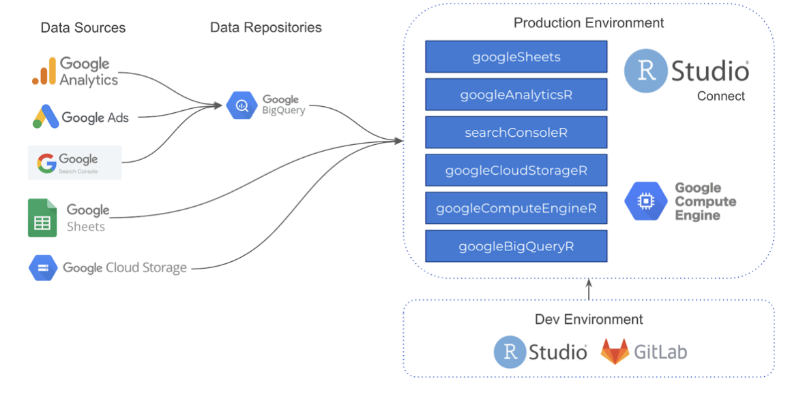

<i>Photo by <a href="https://unsplash.com/@mjessier" target="_blank" rel="noopener noreferrer">Myriam Jessier</a> on Unsplash</i></small>

We recently teamed up with <a href="https://www.extendo.company/en/" target="_blank" rel="noopener noreferrer">Extendo</a> and <a href="https://www.ixpantia.com/en/" target="_blank" rel="noopener noreferrer">ixpantia</a> to learn how they use RStudio to help streamline their digital analytics offerings for more credible and durable marketing insights. 

Extendo, known as <a href="https://www.miweb.digital/" target="_blank" rel="noopener noreferrer">MiWeb</a> in the US, is a digital marketing firm that specializes in offering marketing solutions and strategies. They work with major end user behavior platforms such as Google, Facebook, and Amazon to make sense of the massive amount of data organizations can get from these platforms. ixpantia is an incredibly talented RStudio Full Service Partner in Costa Rica that helps organizations deliver data-driven products and services and develop the infrastructure to support it. 

Listen in Spanish, or read in English or Spanish, how, with the help of ixpantia, Extendo was able to deliver beyond traditional descriptive analysis of marketing platform data, and offer predictive insights that were based on serious data science.

> "Rather than creating and connecting each piece of the architecture, RStudio Connect standardizes this process and allows our team to focus on designing solutions rather than managing the architecture."
>
>--- Paul Fervoy, Co-Founder & VP Business Development

One of the biggest challenges in the world of digital marketing is unifying the plethora of data sources in a secure and robust way. With GDPR further governing how organizations are able to interact with user behavior data, many marketing firms are limited to only providing descriptive analytics based on Google Analytics, Amazon, and Facebook data. Extendo wanted to offer more predictive and reproducible insights, and they realized that they would need a secure and centralized data infrastructure to support that. 

The Extendo team decided to partner with ixpantia to develop a data science workflow centered around RStudio Connect. This code-based infrastructure allowed their data science team to collaborate more efficiently, spend less time troubleshooting IT problems and DevOps hurdles, and ultimately focus on what really matters: delivering credible business insights. 

<small><i>Extendo's data science architecture diagram</i></small>

This discussion is the first customer story that we’ve supported that is not in English, and we certainly hope it isn’t the last. We understand that RStudio is being used by folks all over the world, across all industries, and one of our goals as a company is to create products and resources that everyone can use, regardless of their means, or preferred language. 

You can read more about their story <a href="/about/customer-stories/extendo-en/">here</a> in English or Spanish, or listen in on the full conversation in Spanish <a href="/resources/webinars/como-ixpantia-ayudo-a-extendo-a-poner-r-en-produccion/">here</a>. 

We love hearing about how you are successful with RStudio products, so if you’d like to share your story with us, please <a href="/about/contact/">let us know</a>.  
