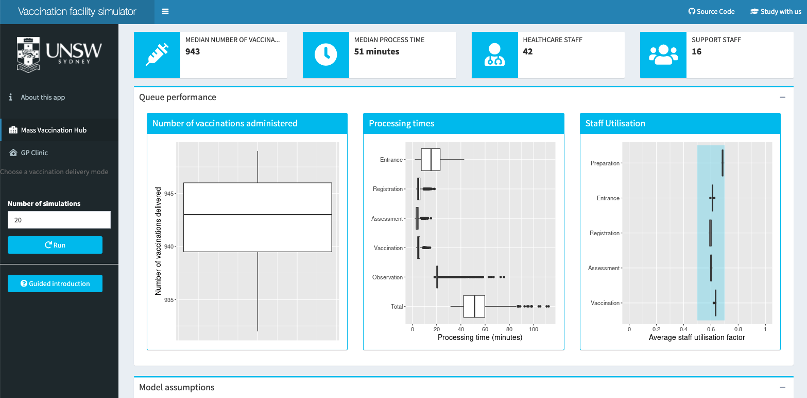
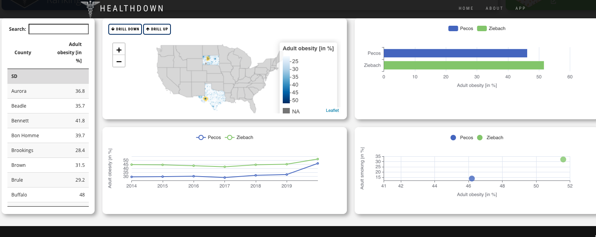
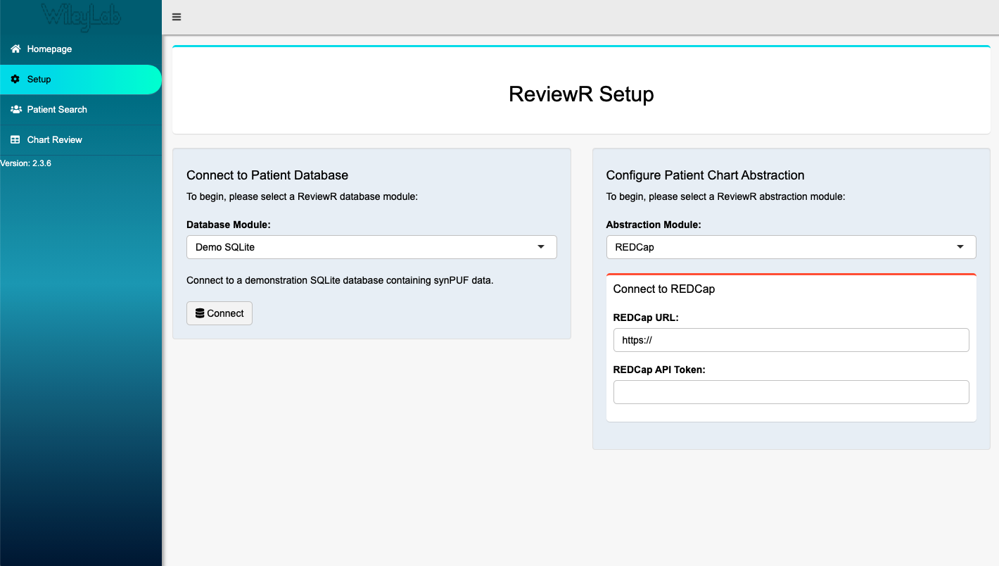

Did you know that Shiny is used every day to help healthcare organizations provide better care and health outcomes to people across the world? As a member of RStudio's Life Sciences & Healthcare team, it's my privilege to learn about many of the ways that data science teams in healthcare innovate with Shiny. This year's Shiny Contest had a number of excellent submissions in healthcare and provides the perfect opportunity to share some of the amazing work being done with Shiny in the industry! We'll highlight three of these applications here. The apps are:

-   [Vaccine Queue Simulator](https://community.rstudio.com/t/vaccine-queue-simulator-shiny-contest-submission/103543) by Mark Hanly, Oisín Fitzgerald, and Tim Churches

-   [Healthdown](https://community.rstudio.com/t/healthdown-shiny-contest-submission/104784) by Peter Gandenberger and Andreas Hofheinz

-   [ReviewR](https://community.rstudio.com/t/reviewr-shiny-contest-submission/104037) by Laura Wiley, Luke Rasmussen, and David Mayer

We'll use these apps to demonstrate some of the use cases for Shiny in healthcare including:

-   [Planning for healthcare capacity](#planning-for-healthcare-capacity)

-   [Comparing health metrics geographically](#comparing-health-metrics-geographically)

-   [Connecting to electronic health records data](#connecting-to-electronic-health-records-data)

## Planning for healthcare capacity

Ensuring optimal supply, space, and staffing resources are available to meet any demands is critical for healthcare systems.  Data Science teams can use R to facilitate this kind of planning, combining multiple data sources and building predictive models for expected resource needs.

The Vaccine Queue Simulator app simulates a vaccination clinic process to estimate the number of vaccinations given, wait times, and staff needed based on the assumptions of the model. The model takes into account many factors that can affect vaccination queues including how staff are distributed across different roles, how long it takes to prepare the vaccine, and whether people arrive on time for appointments. Putting this in a Shiny app makes it easy for anyone to quickly iterate and test out a range of different scenarios for their clinic or mass vaccination center. There's also a great guided install that can help users quickly feel confident running the simulations in the app!

By Mark Hanly, Oisín Fitzgerald and Tim Churches

[App](https://cbdrh.shinyapps.io/queueSim/) - [Code](https://github.com/CBDRH/vaccineQueueNetworks) - [Community Post](https://community.rstudio.com/t/vaccine-queue-simulator-shiny-contest-submission/103543)

## Comparing health metrics geographically

Many of us have seen visualizations recently that show differences in health metrics like infection and vaccination rates across a map. This kind of visualization can be especially helpful for understanding public health trends and for healthcare systems looking to better understand the communities they serve.

The healthdown application won an honorable mention in the 2021 Shiny Contest and shows a great new way to interactively explore health metrics spatially. The app allows users to explore the University of Wisconsin Population Health rankings. The team uses the leafdown package to give users a lot of flexibility to drill down and explore direct comparisons across different states and counties.

By Peter Gandenberger and Andreas Hofheinz

[App](https://hoga.shinyapps.io/healthdown/) - [Code](https://github.com/hoga-it/healthdown) - [Community Post](https://community.rstudio.com/t/healthdown-shiny-contest-submission/104784)

## Connecting to electronic health records data

Getting connected to data in electronic health records (EHR) is the first step for many data science projects in healthcare. Then teams can build reports or visualizations that combine the data in new ways or make it easier for healthcare providers to quickly get insights from the data.

The ReviewR app provides a framework for connecting to EHR data and reviewing patient records in the application. While the app supports the data formats OMOP and MIMIC-III, the authors have also created a vignette to help others extend the use to other formats ([see here](https://reviewr.thewileylab.org/articles/customize_support_new_datamodel.html)). Similarly, they also have a vignette to extend the database connection beyond the Google BigQuery and Postgres connections already built into the app ([here](https://reviewr.thewileylab.org/articles/customize_support_new_rdbms.html)). This app can be a great resource for teams looking to start using or extend how they access EHR data with R, though you'll also want to talk with your IT / database teams to be sure all security standards are met!

By Laura Wiley, Luke Rasmussen, and David Mayer  
[App](https://thewileylab.shinyapps.io/ReviewR/) - [Code](https://github.com/thewileylab/ReviewR) - [Community Post](https://community.rstudio.com/t/reviewr-shiny-contest-submission/104037)

## Interested in learning more about R and Shiny in Healthcare?

The 2021 Shiny contest gave us a chance to highlight three of the ways we see Shiny used in healthcare, but every day we get to see Shiny applied to solve new problems. If this sample has sparked your interest and you want to learn more about how Shiny and R are used across healthcare, check out some of these resources below:

-   [R in Medicine](https://r-medicine.org/)- this virtual conference is happening August 24-27, 2021. The talks from the 2020 virtual conference are also available [here](https://www.youtube.com/playlist?list=PL4IzsxWztPdljYo7uE5G_R2PtYw3fUReo).

-   At a recent RStudio Enterprise Meetup for R in Healthcare, Chris Bumgardner, the data science program manager at Children's Wisconsin shared how his team uses R and Shiny. You can view the recording [here](https://www.youtube.com/watch?v=pHZ8dsc0PhY) or [check out the Q&A](https://blog.rstudio.com/2021/08/03/r-in-healthcare-meetup-q-a/).

-   Shiny was used to help with West Virginia's COVID vaccine distribution, [learn  about the role Shiny played](https://www.youtube.com/watch?v=CYilc-rEgjg) and [tour the app](https://www.youtube.com/watch?v=T2DzDs0ksZY).

And if you're at a healthcare organization and currently wondering how to put Shiny in production and/or use R in a way that aligns with your team's security needs, feel free to send an email to the RStudio Life Sciences & Healthcare team at [life-sciences-healthcare@rstudio.com](mailto:life-sciences-healthcare@rstudio.com). We love to meet new teams and support the work happening in healthcare!
