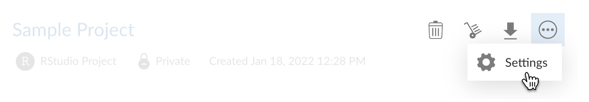
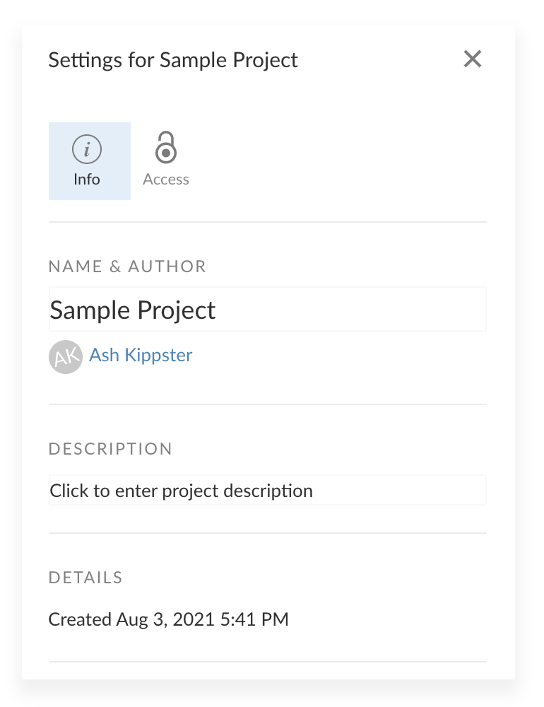
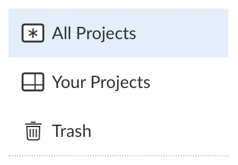
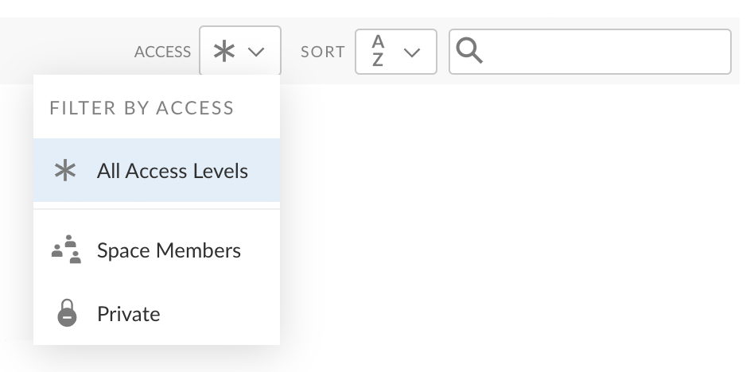
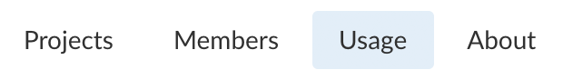
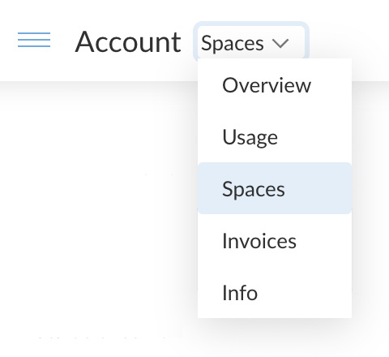

Whether you want to do, share, teach, or learn data science, <a href="https://www.rstudio.com/products/cloud/" target = "_blank">RStudio Cloud</a> is a cloud-based solution that allows you to do so online. The RStudio Cloud team has rolled out new features and improvements since our <a href="https://www.rstudio.com/blog/what-s-new-on-rstudio-cloud-september-2021/" target = "_blank">last post in September 2021</a>. So what’s new?

## Students Pay Option for Instructors

If you want to use RStudio Cloud to teach, but are not in a position to cover costs for your students, you can now choose to have each student pay for their course access. See the <a href="https://rstudio.cloud/plans/instructor?option=student" target = "_blank">Cloud Instructor</a> page for more details on the option, but here are the basics:

* You, the instructor, sign up for the Instructor plan with the <a href="https://rstudio.cloud/plans/instructor?option=student" target = "_blank">Students Pay</a> option. You pay $15 / month.
* You create your course space and invite your students to the space.
* To work on projects in your space, a student must sign up for a paid subscription to Cloud - typically the <a href="https://rstudio.cloud/plans/plus" target = "_blank">Cloud Plus</a> plan for $5 / month is the right option for students.
* If a student attempts to create or open a project in your course space and does not have a paid subscription, they will be prompted to sign up for one.
* Within your course space, you and your students have access to all premium features associated with the Instructor plan, and there are no usage charges for work done there.

See the <a href="https://rstudio.cloud/learn/guide#course-spaces" target = "_blank">Teaching with Cloud</a> section of the Guide for details on all the available Instructor plan options.

## Easier Access to Project Settings

You can now change a project's settings directly from any projects listing. Edit the project's name or description, or change who can access it - without opening the project.

**HOW TO**

1. In a projects listing, press the  button to open any project's menu and then choose Settings.

 

2. Use the Info and Access settings panels to view or edit the project's settings.

 

For more info on project settings, see the <a href="https://rstudio.cloud/learn/guide#project-settings" target = "_blank">Project Settings</a> section of the Guide.

## Faster Package Installation

We recently integrated RStudio Cloud with <a href="https://packagemanager.rstudio.com/client/#/" target = "_blank">RStudio Public Package Manager</a>. Package Manager provides pre-built binaries for all packages on CRAN. As a result, you will see much faster package installs. You can learn more about RStudio Package Manager <a href="https://www.rstudio.com/products/package-manager/" target = "_blank">on our website</a>.

## New Layout & Project Filtering Options

We released several UI improvements, as follows:

* **Project Lists Navigator:** You can now switch between different project lists via a navigation pane on the left-hand side of the Projects area.

 

* **New Filtering Options:** You can filter any project list according to the access level of the projects via a drop-down menu.

 

* **More Obvious Usage Area Access:** The Usage area for Your Workspace and shared spaces is now accessible via a text navigation item (rather than discreetly tucked away behind an icon).

 

* **More Obvious Trash Access:** The trash for a space is now accessible via the Project Lists Navigator mentioned above (rather than via an icon in the header).

* **Better Navigation on Smaller Screens:** On smaller screens, the different areas in your current context are accessible via a drop-down menu in the header (rather than discreetly tucked away in the main navigation sidebar or user panel).

 

## Maximum RAM Doubled

Cloud Premium and Instructor plans now allow you to allocate up to 16GB RAM per project, double the previous limit of 8GB.

**HOW TO**

Visit the <a href="https://rstudio.cloud/learn/guide#project-settings-resources" target = "_blank">Project Resources</a> section of the Guide to learn how to adjust the RAM and other resources allocated to a project.

## Learn More About RStudio Cloud

We are excited to provide you with more capabilities so that you can jump right into your data science work. For more information and resources, please visit:

* <a href="https://www.rstudio.com/products/cloud/" target = "_blank" rel = "noopener noreferrer">RStudio Cloud Product Page</a>
* <a href="https://rstudio.cloud/learn/whats-new" target = "_blank" rel = "noopener noreferrer">What's New on RStudio Cloud</a>
* <a href="https://community.rstudio.com/c/rstudio-cloud/14" target = "_blank" rel = "noopener noreferrer">RStudio Cloud Page on RStudio Community</a>
