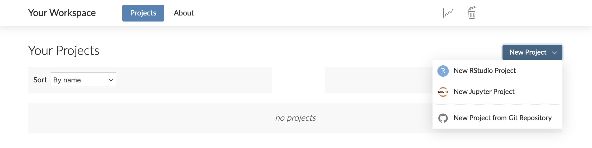
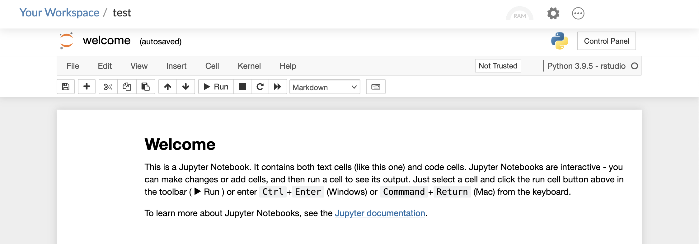

Whether you want to do, share, teach, or learn data science, <a href="https://www.rstudio.com/products/cloud/" target = "_blank" rel = "noopener noreferrer">RStudio Cloud</a> is a cloud-based solution that allows you to do so online. The RStudio Cloud team has rolled out new features and improvements since our last post in <a href="https://blog.rstudio.com/2021/05/03/rstudio-cloud2/" target = "_blank" rel = "noopener noreferrer">May 2021</a>. So what’s new?

* Create and work with Jupyter Notebook projects as easily as RStudio IDE projects (currently in beta — <a href="https://community.rstudio.com/c/rstudio-cloud/14" target = "_blank" rel = "noopener noreferrer">we'd love your feedback!</a>)
* Work with more flexibility on RStudio Cloud with more hours per plan, more disk space per project, and a lower price for additional hours
* Stay up to date with an automatic upgrade to Ubuntu 20.04 for all projects currently running Ubuntu 16.04

Let’s take a closer look at these updates.

**Expand your data science workbench with Jupyter projects**

Jupyter Notebook projects are now available to Premium, Instructor, or Organization account holders. Once you are in <a href="https://rstudio.cloud/)" target = "_blank" rel = "noopener noreferrer">RStudio Cloud</a>, you can create and work with Jupyter projects as easily as RStudio IDE projects. Click on the New Project button, then select New Jupyter Project from the menu that appears. If you haven't yet joined the beta program, you will be prompted to fill out a brief form — submit that and we'll get you into the program ASAP.

Doing so allows you to work in a Jupyter notebook:

This functionality is currently in beta — <a href="https://community.rstudio.com/c/rstudio-cloud/14" target = "_blank" rel = "noopener noreferrer">we'd love to hear your feedback</a>.

**Pay Less! Get More!**

Need more time for your analysis? Or have other projects that you’d like to run? In RStudio Cloud, we’ve provided you with more cost-effective options  for your data science work. We have bumped up the number of projects available on the Free and Plus plans to fifty. We have also provided more flexibility if you need more time by increasing the monthly project hours included in each plan and halving the cost per additional hour.

  <table class="table table-striped">
    <tr>
     <td>
     </td>
     <td><b>Number of projects included</b>
     </td>
     <td><b>Monthly project hours included</b>
     </td>
     <td><b>Cost per additional project hour</b>
     </td>
    </tr>
    <tr>
     <td>Free plan
     </td>
     <td><strong>50</strong> (was 15)
     </td>
     <td><strong>25</strong> (was 15)
     </td>
     <td>-
     </td>
    </tr>
    <tr>
     <td>Plus plan
     </td>
     <td><strong>50</strong> (was 15)
     </td>
     <td><strong>75</strong> (was 50)
     </td>
     <td><strong>10¢ </strong>(was 20¢)
     </td>
    </tr>
    <tr>
     <td>Premium plan
     </td>
     <td>Unlimited
     </td>
     <td><strong>200</strong> (was 160)
     </td>
     <td><strong>10¢ </strong>(was 20¢)
     </td>
    </tr>
    <tr>
     <td>Instructor plan
     </td>
     <td>Unlimited
     </td>
     <td><strong>300</strong> (was 160)
     </td>
     <td><strong>10¢ </strong>(was 20¢)
     </td>
    </tr>
  </table>

In addition, each project can now store up to 20GB of files, data, and packages on disk, up from the prior 3GB for files and data, and 3GB for packages.

**Work with confidence with upgraded Ubuntu**

In RStudio Cloud, you can use the latest versions of R and Python packages with confidence that the underlying operating system has the features they require. Starting on September 13, 2021, all projects still running Ubuntu 16.04 (Xenial) will be automatically upgraded to Ubuntu 20.04 (Focal) the next time they are opened. For more information, please visit this <a href="https://community.rstudio.com/t/rstudio-cloud-ubuntu-16-04-eol-on-sept-13-2021/113409" target = "_blank" rel = "noopener noreferrer">community article</a>.

**Learn more about RStudio Cloud**

We are excited to provide you with more capabilities so that you can jump right into your data science work. For more information and resources, please visit:

* <a href="https://www.rstudio.com/products/cloud/" target = "_blank" rel = "noopener noreferrer">RStudio Cloud Product Page</a>
* <a href="https://rstudio.cloud/learn/whats-new" target = "_blank" rel = "noopener noreferrer">What's New on RStudio Cloud</a>
* <a href="https://community.rstudio.com/c/rstudio-cloud/14" target = "_blank" rel = "noopener noreferrer">RStudio Cloud Page on RStudio Community</a>
