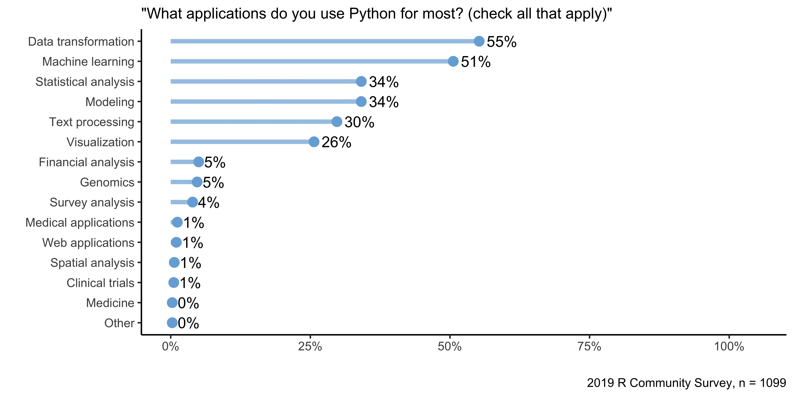

As RStudio's products have increasingly supported Python over the past year, some of our seasoned customers have given us quizzical looks and ask, "Why are you adding Python support? I thought you were an R company!"

Just to set the record straight, RStudio does love R and the R community, and we have no plans to change that. However, if RStudio's goal is to "enhance the production and consumption of knowledge by everyone, regardless of economic means" (which is what we say in [our mission statement)](https://rstudio.com/about/), that means we have to be open to all ways of approaching that goal, not just the R-based ones.

This still leaves open the question of why we would embrace a language that some in the data science world think of as a competitor. And while I can't claim we have a definitive answer, we do have something more than anecdotes to encourage R users to embrace Python as well. We have data.

## Survey Data Says "R and Python Are Used for Different Things"

> "In God we trust; others must provide data."
>
> <i> -- Attributed to W. Edwards Deming and others, <a href="https://quoteinvestigator.com/2017/12/29/god-data/" target="_blank" rel="noopener noreferrer"> including Anonymous</a></i>

RStudio has run a broad-based survey of people who use or intend to use R over the past two years. In the <a href="https://community.rstudio.com/t/help-us-better-understand-the-r-community-by-completing-the-2nd-annual-r-community-survey/47242" target="_blank" rel="noopener noreferrer">2019 edition of the survey</a>, we asked our more than 2,000 respondents to answer two questions:

> "What applications do you use R for most?"

and

> "What applications do you use Python for most?"

Respondents were allowed to check as many answers as they wished in both cases. They also were allowed to enter their own application categories as an open-ended response. It is important to note that while this data is indicative of user attitudes, it is by no means conclusive.

Below are the summary plots for the results of these survey questions.

<caption>
Figure 1: R is used most commonly for visualization, statistical analysis, and data transformation.
</caption>

<caption>Figure 2: R users employ Python most commonly for data transformation and machine learning.
</caption>

Taking these charts at face value (again, read the next section before you do that), we can draw some interesting conclusions:

-   **R users use Python!** We had just over 2,000 survey respondents who said they use R while nearly 1,100 survey respondents said they used Python. Because our survey is focused on R users, this means that **roughly half of our respondents are using Python as well as R.**

-   **Visualization and statistical analysis are R's most common uses.** Nearly 9 out of 10 R users apply it in these ways. Data transformation is also a close third place.

-   **Data transformation and machine learning are Python's most common applications.** A majority of Python users do data transformation and machine learning with the language. No other applications are as common; only a third of Python users use it for statistical analysis or modeling.

## Think of These Results As Directional Instead of Hard Numbers

While these analyses are interesting and the sample sizes reasonable, readers should understand that these results aren't really representative of all data scientists. As the creator and primary analyst for this survey, I can give you several reasons why you shouldn't put too much stock in these numbers beyond their overall direction:

-   **We only surveyed people interested in R.** The introduction to the survey specifically says that it is open to "anyone who is interested in R, regardless of whether they have learned the language." If a Python-only user looked at the survey, it's unlikely they would have completed it, which means they aren't represented in the results.

-   **We didn't do a random sample.** We solicited responses by asking RStudio employees to invite their Twitter and RStudio Community followers to fill it out. It's highly unlikely that our friends and followers are representative of the larger data science or statistics community, and it undoubtedly leaves out broad swaths of the population of programmers and data scientists.

-   **None of the data has been weighted to be representative of any broad population.** We have not weighted the anonymous demographic information collected in the survey to represent any larger population. That means the survey may have significant gender, ethnic, industry, and educational biases that we haven't corrected for.

The best way to think of this survey is that it represents the views of a few thousand of RStudio's friends and customers. While this doesn't give us any conclusions about the general population of data scientists or programmers, we can use it to think about what we can do to make those people more productive.

## RStudio Should (and Does) Support Both R and Python

Despite the fact that we can't use this survey for general conclusions, we can use this data to think about how RStudio should support our customers and data science community in their work:

-   **We should reject the myth that users must choose between R or Python.** We had always hypothesized that R users use more than one language to do data science. The data we collected from this survey supports that hypothesis. Becoming an R-only company would only make data science jobs more difficult.

-   **We should embrace Python because fully half of our community uses it in addition to R.** With more than 50% of R users applying Python to various applications, not supporting Python would force those users to use other tools to get their jobs done.

-   **Embracing Python as well as R means that our products should support it too.** Forcing data scientists to swap back and forth between different programming environments is inefficient and lowers productivity. By supporting Python in all our products, both free and commercial, we can help our customers get results faster and more seamlessly. That in turn, will help RStudio achieve our broader mission: "to enhance the production and consumption of knowledge by everyone, regardless of economic means".

While RStudio already <a href="https://rstudio.com/solutions/r-and-python/" target="_blank" rel="noopener noreferrer">offers Python support in its products</a>, we'll be adding to that support in new versions that will be released in the coming months. Those announcements will appear both here on blog.rstudio.com and on the main web site, so check regularly for when those are released.

### Survey Details

RStudio fielded its 2019 R community survey beginning on December 13, 2019. We closed the survey on January 10, 2020 after it had accumulated 2,176 responses. Its details are as follows:

- The survey was fielded in both English and Spanish. Of the 2,176 responses, 1,838 were in English and 338 were in Spanish. All Spanish results were translated into English for analysis.
- The survey consists of 52 questions, but it includes branching so not all respondents answer all questions. It also includes questions to detect survey-completing robots.
- Respondents were solicited from posts on community.rstudio.com and Twitter followers of RStudio employees.
- Survey results are not representative of any broader population
- Complete data and incomplete processing scripts can be found in the survey's <a href="https://github.com/rstudio/learning-r-survey" target="_blank" rel="noopener noreferrer">Github repository</a>
- The data and scripts are open source and available to anyone interested.
- RStudio expects to field this year's survey in December, 2020.

