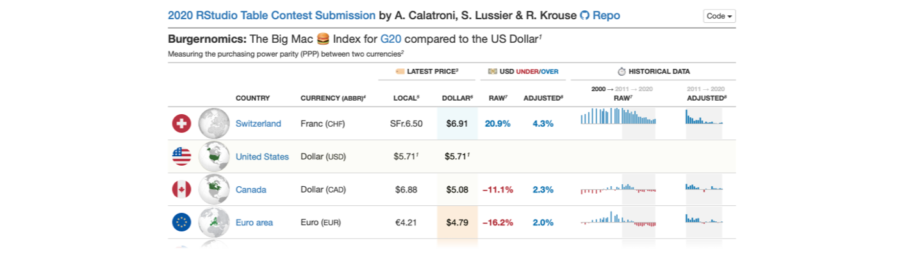

The inaugural 2020 RStudio Table Contest came to a close in mid-November and we were delighted to see that over 80 entries were submitted. With such enthusiasm for tables, it took some time to look over all of the entries but we do have a winner.

## The Winner and the Runner-up

The winner is an entry by Niels van der Velden called Editable Datatables in R Shiny Using SQL. Niels provides a [detailed tutorial here](https://www.nielsvandervelden.com/post/sql_datatable/editable-datatables-in-r-shiny-using-sql/) (along with a [live example](https://niels-van-der-velden.shinyapps.io/employee_directory_crud_app/) and [GitHub repository](https://github.com/nvelden/Employee_Directory_CRUD)). It's a great demonstration of an interactive employee directory where a DT table is central in presenting the employee information. Shiny provides all of the interactivity and the {pool} package handles the storage of the entries with a database backend. Learn more at [RStudio Community](https://community.rstudio.com/t/employee-directory-editable-dt-table-contest-submission/81403).

A close runner-up is an entry by Maya Gans (previous RStudio intern!) that presents the Table Generator Shiny extension available in the {tidyCDISC} package ([live example](https://maya-gans.shinyapps.io/tablecontest-biogen/), [GitHub repository](https://github.com/biogen-inc/tidycdisc/tree/table-contest)). This is a complete table-generation system where users could provide their own clinical data and make summary tables without any programming effort. The Shiny application allows for dragging pairs of columns and their summary statistic counterpart to create a {gt} table. There's great flexibility to customize the generated tables as one could subgroup, filter, and reorder the underlying table structure. Crucially, the app supports table export to either HTML or CSV. Learn more at [RStudio Community](https://community.rstudio.com/t/tidycdisc-table-contest-submission/86688).

Honorable Mentions

There were so many great entries that we'd like to highlight as honorable mentions. All of these were either in the form of a static table or as a tutorial.

### Static Tables

A large portion of the contest entries were in the form of a static (i.e., not Shiny-based) table. In quite a few cases interactive bits (e.g., sparkline plots) were interspersed in table cells, making for a delightful experience. Here are a few of the tables that deserve some attention.

Beyoncé and Taylor Swift Albums, by Georgios Karamanis ([live example](https://github.com/gkaramanis/tidytuesday/blob/master/2020-week40/plots/beyonce-swift.png), [GitHub repository](https://github.com/gkaramanis/tidytuesday/tree/master/2020-week40), [RStudio Community](https://community.rstudio.com/t/86399))

 

What do I binge next? An overview of the top IMDb TV shows, by Cédric Scherer ([live example](https://cedricscherer.netlify.app/files/IMDb_Top250.png), [GitHub repository](https://github.com/Z3tt/Rstudio_TableContest_2020), [RStudio Community](https://community.rstudio.com/t/86409)).

 

2019 NFL Team Ratings, by Kyle Cuilla ([live example](https://rpubs.com/kcuilla/nfl_team_ratings), [GitHub repository](https://github.com/kcuilla/2020-RStudio-Table-Contest), [RStudio Community](https://community.rstudio.com/t/81205)).

 

The Big Mac Index Table, by A. Calatroni, S. Lussier & R. Krouse ([live example](https://rpubs.com/acalatroni/682678), [GitHub repository](https://github.com/agstn/RStudio_table_contest_2020), [RStudio Community](https://community.rstudio.com/t/86123)).

 

Technology Figures of the EU, by Florian Handke ([live example](https://rpubs.com/FlorianHandke/table_contest_2020), [GitHub repository](https://github.com/FlorianHandke/RStudio_Table_Contest_2020), [RStudio Community](https://community.rstudio.com/t/87855)).

 

Imperial March, by Bill Schmid ([live example and repository](https://github.com/schmid07/R-Studio-Table-Contest-Submission), [RStudio Community](https://community.rstudio.com/t/86345)).

### Tutorials

Sometimes in order to learn a new package or feature it helps to get a more-involved walkthrough. Tutorials are long form articles that dive into a set of features, table-package, or multiple packages, with the goal of giving the reader a deeper understanding of how it all works.

Comparison Tutorial, by Evangeline 'Gina' Reynolds ([tutorial](https://evamaerey.github.io/tables/about), [GitHub repository](https://github.com/EvaMaeRey/tables), [RStudio Community](https://community.rstudio.com/t/87978)).

Replicating a New York Times Table of Swedish COVID-19 Deaths with gt, by Malcolm Barrett ([tutorial](https://malco.io/2020/05/16/replicating-an-nyt-table-of-swedish-covid-deaths-with-gt/), [GitHub repository](https://github.com/malcolmbarrett/malco.io/blob/master/content/post/2020-05-16-replicating-an-nyt-table-of-swedish-covid-deaths-with-gt/index.Rmd), [RStudio Community](https://community.rstudio.com/t/82423)).

Recreating a Table by The Economist with Reactable, by Connor Rothschild ([tutorial](https://www.connorrothschild.com/post/economist-table-replication-using-reactable), [GitHub repository](https://github.com/connorrothschild/economist-table-replication), [RStudio Community](https://community.rstudio.com/t/84725)).

Top of the Class: Public Spending on Education, by David Smale ([tutorial](https://davidsmale.netlify.app/portfolio/spending-on-education/), [GitHub repository](https://github.com/committedtotape/education-spending), [RStudio Community](https://community.rstudio.com/t/86113)).

### Table Packages

A number of submissions were essentially submissions of the author's package, which supports creating or customizing tables in some way. In fact, the grand prize and runner up are both examples of this! Below are additional honorable mention entries of these table-package submissions.

DataEditR: Interactive Editor for Viewing, Filtering, Entering & Editing Data, by Dillon Hammill ([GitHub repository](https://github.com/DillonHammill/DataEditR/), [RStudio Community](https://community.rstudio.com/t/87976)).

A Not So Short Introduction to rtables, by Gabriel Becker, Adrian Waddell ([post](https://waddella.github.io/RStudioTableContest2020/A_Not_So_Short_Introduction_to_rtables.html), [GitHub repository](https://github.com/waddella/RStudioTableContest2020), [RStudio Community](https://community.rstudio.com/t/86538)).

## In Closing

We want to thank you all for making this Table Contest so great. It is incredibly hard to judge submissions with such an overall high level of quality. We fully acknowledge that there are many other really great entries we did not highlight in this article. We encourage you to check out all of the entries at [RStudio Community](https://community.rstudio.com/tags/c/R-Markdown/tables/38/table-contest).

There were so many great submissions that our [growing R Markdown team](https://blog.rstudio.com/2020/12/21/rmd-news/) is considering hosting a *tables gallery* with examples that others can learn from or use as launching pad for their own display tables. We'd love to hear your comments and suggestions [in RStudio Community!](https://community.rstudio.com/t/2020-table-contest-winners/91517/2)
