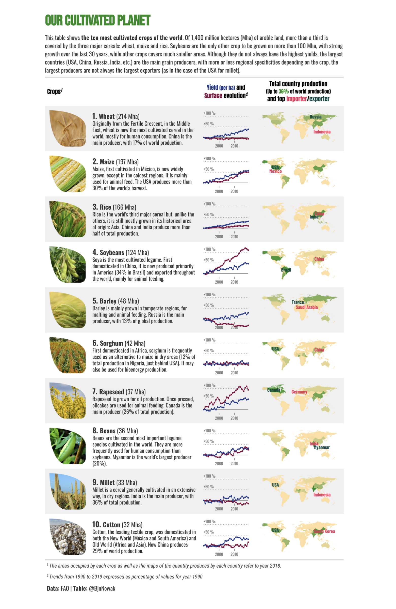
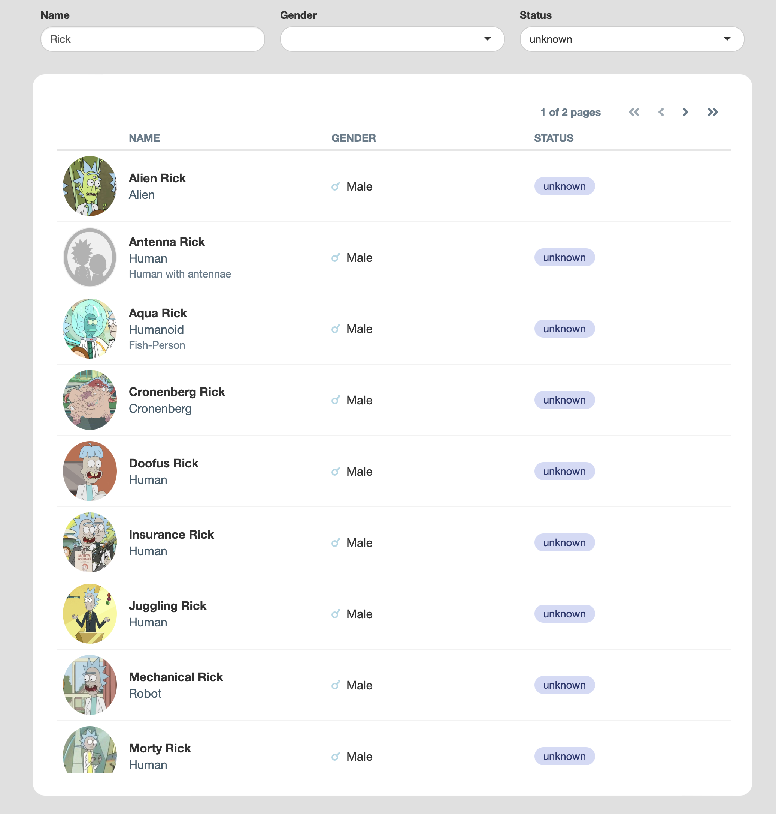
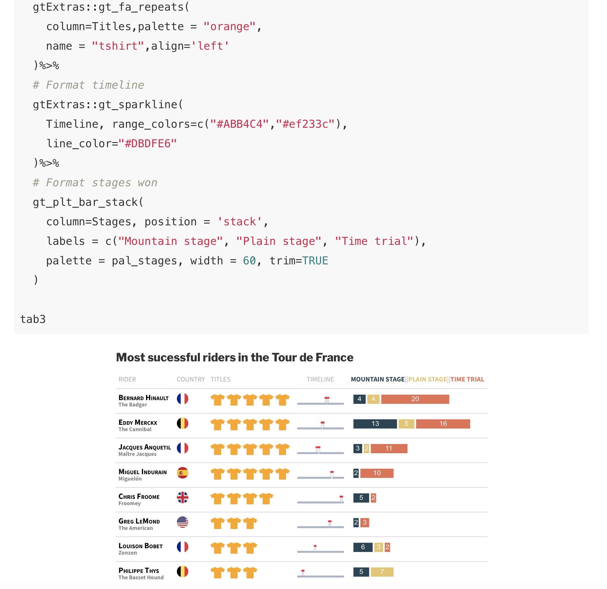
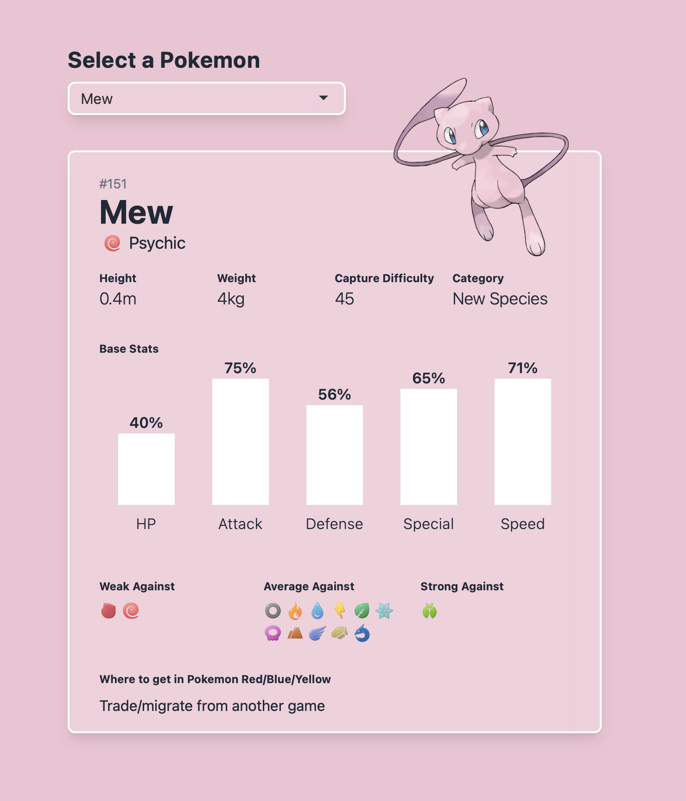
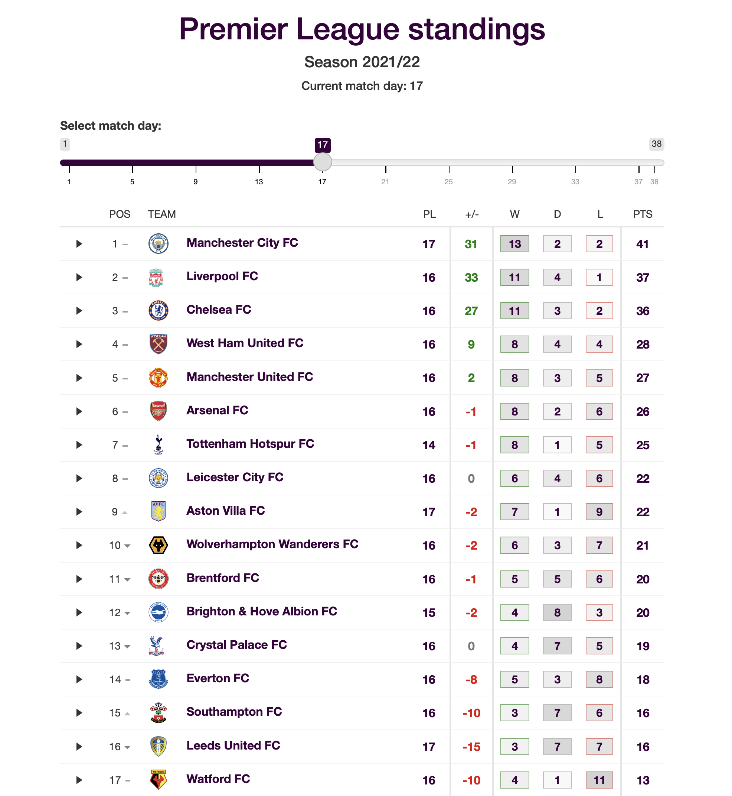

We are excited to announce this year's winners of the 2021 RStudio Table Contest. 

Display tables are a fundamental way we summarize and communicate information. But in many instances, these are boring and created without as much thought as they deserve. Until recently, customizing and styling a table to make it just right could be a painful and time-consuming experience. 

But not today. We now have numerous R packages at our disposal to generate well-designed and beautiful presentation tables. And this community has gone out of its way to share some great examples and tutorials on how to do this. 

## Evaluation and Judging

Submissions were evaluated based on technical merit and artistic achievement. We would like to thank all of this year's judges. Thank you to [Greg Lin](https://github.com/glin), [Tom Mock](https://twitter.com/thomas_mock), [Samantha Toet](https://www.linkedin.com/in/samanthatoet/), and [Isabella Velásquez](https://twitter.com/ivelasq3) for all your help in evaluating submissions and your thoughtful comments.

**Types of Submissions**

* **Single Table Example**: These may highlight interesting structuring of content, useful and tricky features, or serve as an example of a common table popular in a specific field. All submissions include well-organized, documented code reproducing the table. 
* **Tutorial**: It’s all about teaching us how to craft an excellent table or understand a package’s features. These may include several tables and include narrative.

**Categories** - We placed tables into one of the following categories:

* **Interactive HTML** - An HTML table, built with R, with interactivity. 
* **Interactive Shiny** - Interactive tables built with Shiny. 
* **Static** - Tables that do not have interactive elements. These may be designed for print or HTML.

## The Winner

**Satellites** - by Vladislav Fridkin - _interactive / Shiny_

_An interactive table of satellites built with Shiny, {reactable}, and {gt}_

There might be prettier ways to show the 1000s of satellites orbiting us, but how does one effectively organize all the associated data? This Shiny app generates a table summarizing data associated with a selection of satellites. This seems like a really smart way to engage interested people into exploring this type of data. 

[App](https://vfridkin.shinyapps.io/Satellites/) – [Repo](https://github.com/vfridkin/satellite_table) – [Community](https://community.rstudio.com/t/satellites-table-contest-submission/120539)

--------

## Runner Up 

**One Farm** - by Benjamin Nowak - _static / HTML_

_A set of static tables that look like they were ripped out from the pages of a magazine!_

These tables are beautifully designed and they  present a lot of information in a very digestible way. Love the use of hierarchy, color, and text with plots/images.

[Table](https://raw.githubusercontent.com/BjnNowak/CultivatedPlanet/main/Tables/CultivatedPlanet_V2.png) – [Repo](https://github.com/BjnNowak/CultivatedPlanet/tree/main) – [Community](https://community.rstudio.com/t/one-farm-table-contest-submission/117744)

-----

## Honorable Mentions

**Describer: An Interactive Table Interface for Data Summaries** - by Agustin Calatroni, Rebecca Krouse and Stephanie Lussier - _interactive / HTML_

_A dream come true for summarizing and inspecting datasets!_

A capable tool in a Shiny app for summarizing any dataset. A lot of information is accessible and easily scannable in the default view and the small plots are welcomed and extremely useful. That it handles variable descriptions and provides detailed summaries is a great achievement.

[App](https://agstn.github.io/describer/adsl_describer.html) – [Repo](https://github.com/agstn/describer) – [Community](https://community.rstudio.com/t/describer-an-interactive-table-interface-for-data-summaries-table-contest-submission/121483)

------

**Using {gt} and {openair} to Present Air Quality Data** - by Jack Davison - _static / HTML_

_Tabulated air quality summaries from the legendary {openair} package._

This tutorial provides an introduction to gt and is aimed toward air quality professionals that already have some foundation in R. It shows how to take outputs from the well-established {openair} package and present them effectively in tables with {gt} and {gtExtras}.

[Article](https://rpubs.com/JackDavison/gt-openair) – [Repo](https://github.com/jack-davison/rstudio_table-contest_2021) – [Community](https://community.rstudio.com/t/using-gt-and-openair-to-present-air-quality-data-table-contest-submission/119603)

------

**Presentation-Ready Data Summary** - by Michael Curry and Daniel Sjoberg - _static / tutorial_

_An informative package vignette for creating a compelling data summary._

This is from the authors of the {gtsummary} package. Turns out, you can do a lot after introducing a dataset to the `tbl_summary()` function. Customizations galore here folks.

[Article](https://www.danieldsjoberg.com/gtsummary/articles/tbl_summary.html) – [Source](https://github.com/ddsjoberg/gtsummary/blob/master/vignettes/tbl_summary.Rmd) – [Community](https://community.rstudio.com/t/presentation-ready-data-summary-table-contest-submission/120994)

------

**R for Clinical Study Reports and Submission** - by Yilong Zhang, Nan Xiao, and Keaven Anderson - _static / tutorial_

_If you’re in Pharma and making tables, make sure to read this thoroughly._

It’s rare that we get guidance on anything but if you’re responsible for creating tables for regulatory submissions in the Pharmaceutical Industry, then this online book is for you.

[Book](https://elong0527.github.io/r4csr/index.html) – [Repo](https://github.com/elong0527/r4csr) – [Community](https://community.rstudio.com/t/r-for-clinical-study-reports-and-submission-table-contest-submission/116788)

------

**Fast Big Data Tables in Shiny** - by Ryszard Szymański - _interactive / tutorial_

_Big *and* fast tables?! Well, that’s a dream come true and we have Shiny and Plumber to thank for it._

If you have some pretty large data you can benefit from pagination from external resources. Thanks to Plumber, this is relatively easy. Thanks to Shiny, we can make it all highly interactive. Thanks to the myriad characters in Rick and Morty, we have a lot of records in the example app.

[App](https://rszymanski.shinyapps.io/table-contest/) – [Tutorial](https://github.com/rszymanski/table-contest/blob/main/README.md) – [Community](https://community.rstudio.com/t/fast-big-data-tables-in-shiny-table-contest-submission/121358)

-------

**Sparklines with {reactablefmtr}** - by Kyle Cuilla - _static / tutorial_

_This was once very hard to do. Not anymore!_

There are times when you want little plots to go inside a table. Might as well make it sparky. Thanks to {reactablefmtr}, a package that makes it easy to format reactable tables, you can do this with ease!

[Article](https://kcuilla.github.io/reactablefmtr/articles/sparklines.html) – [Source](https://github.com/kcuilla/reactablefmtr/blob/main/vignettes/sparklines.Rmd) – [Community](https://community.rstudio.com/t/interactive-sparklines-with-reactablefmtr-table-contest-submission/120665)

------

**Riding Tables with {gt} and {gtExtras}** - by Benjamin Nowak - _static / tutorial_

_Learn a lot about {gt} and {gtExtras} and create a deluxe table in the end._

This tutorial focuses on making an awesome table with {gt} and  {gtExtras}. You’ll learn all the little tricks on how to make the final table look super impressive!

[Article](https://bjnnowak.netlify.app/2021/10/04/r-beautiful-tables-with-gt-and-gtextras) – [Source](https://github.com/BjnNowak/BjnNowak/blob/main/content/post/2021-10-04-r-beautiful-tables-with-gt-and-gtextras/index.Rmd) – [Community](https://community.rstudio.com/t/riding-tables-with-gt-and-gtextras-table-contest-submission/117184)

--------

**Imperial March Redux** - by Bill Schmid - _interactive / HTML_

_A souped up version of the previous year’s entry, this time using {reactable}!_

This submission is a new version of the table submitted for last year’s contest. This time, the {reactable} package was used to add a lot more interactivity to the table (plus, details sections for every row). Check it out!

[Table](https://schmid07.github.io/NBA-R/plots/04/2020_41_bball_react.html) – [Source](https://github.com/schmid07/NBA-R) – [Community](https://community.rstudio.com/t/imperial-march-ncaa-basketball-reactable-reactablefmtr-table-contest-submission/121602)

------

**From Vines to Wines: the most exceptional wines from all over the world** - by Abdoul ISSA BIDA - _static / HTML_

_Looks great and really increases your knowledge of fine wines._

A great-looking informational table about wines. We all  really enjoyed the pairing of icons with text throughout (especially in the column header area). Both R and Python were used to scrape the data for this one.

[Table and Source](https://github.com/AbdoulMa/RStudio-Table-Contest-2021) – [Community](https://community.rstudio.com/t/from-vines-to-wines-the-most-exceptional-wines-from-all-over-the-world-table-contest-submission/121492)

-------

**Pokémon Red/Blue/Yellow Information Table** - by Kyle Butts - _interactive / Shiny_

_A dashboard/Pokédex/Shiny app that uses tables build from CSS grid + flex._

If you ever wanted to see how the {shiny.tailwind} could be used to generate a really nice Shiny app with no need for custom CSS, have a look at this entry. The result is a highly informational, yet beautiful, app that is a joy to behold.

[App](https://kyle-butts.shinyapps.io/RStudio_2021_Table_Comp/) – [Source](https://github.com/kylebutts/RStudio_2021_Table_Comp) – [Community](https://community.rstudio.com/t/pokemon-red-blue-yellow-information-table-table-contest-submission/121448)

-------

**Premier League Standings 2021** - by Greta Gasparac - _interactive / Shiny_

_A treasure trove of data for the Premier League, all presented quite beautifully._

This is a good example of a minimalistic table with exploration built in. The shiny components are useful here and make cruising around the data fun to do. The design choices were carefully considered and that makes the display of information much easier to parse.

[App](https://ggapac.shinyapps.io/PL-table-shiny/) – [Source](https://github.com/ggapac/PL-table-shiny) – [Community](https://community.rstudio.com/t/premier-league-standings-2021-table-contest-submission/121418)

-------

**Histable** - by Milos Vilotic - _interactive / Shiny_

_Is it a table? Is it a histogram? It’s kinda both!_

The Histable is a Shiny app with an interactive DT table. Clicking on a column does something a little unexpected but a whole lot useful: the table shows a histogram of the selected values! Because of this, users can quickly visualize a distribution across the table.

[App](https://capandchange.shinyapps.io/histable/) – [Source](https://github.com/milosvil/histable) – [Community](https://community.rstudio.com/t/histable-table-contest-submission/121002)

---------

**Crosstable, easily describe your dataset**  - by Dan Chaltiel - _static / tutorial_

_Summarize and tabularize your dataset with just one function._

This is a very nice  tutorial that introduces people to the {crosstable} package. The package provides a single function `crosstable()` that computes descriptive statistics on datasets and interfaces with {officer} to create automated reports.

[Article](https://danchaltiel.github.io/crosstable/) – [Repo](https://github.com/DanChaltiel/crosstable) – [Community](https://community.rstudio.com/t/crosstable-easily-describe-your-dataset-table-contest-submission/120496)

------

## In Closing 

We want to thank you all for making this Table Contest so great. It is incredibly hard to judge submissions with such an overall high level of quality. We fully acknowledge that there are many other really great entries we did not highlight in this article. We encourage you to check out all of the entries at RStudio Community.

One thing we love about the R community is how open and generous you are in sharing the code and process you use to solve problems. This lets others learn from your experience and invites feedback to improve your work. We hope this contest encourages more sharing and helps to recognize the many outstanding ways people work with and display data with R.
