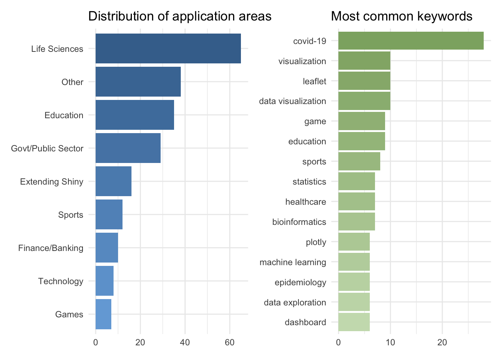
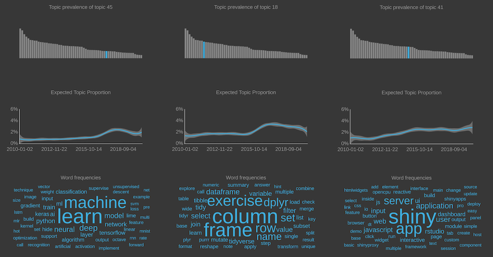
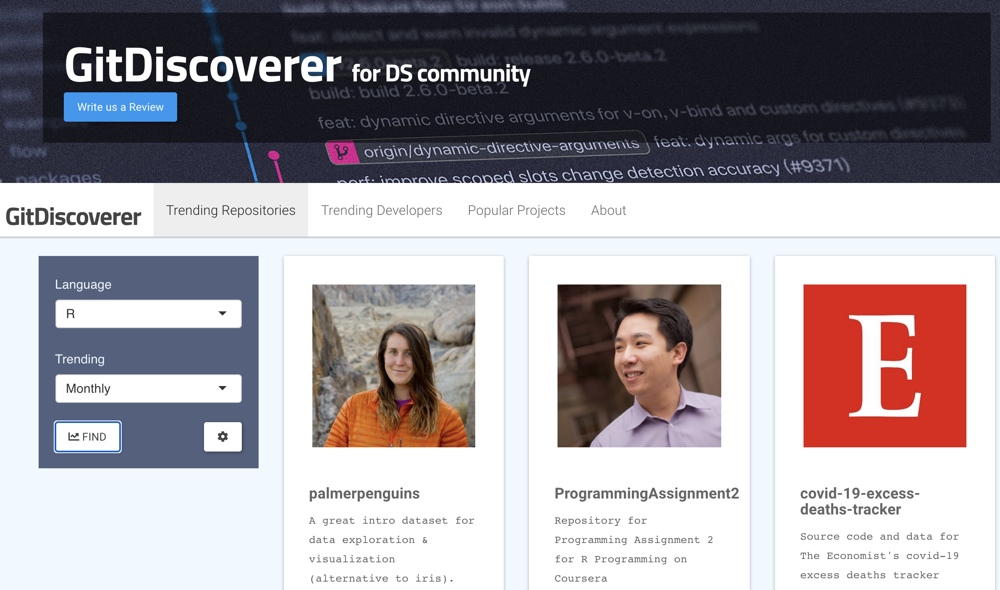
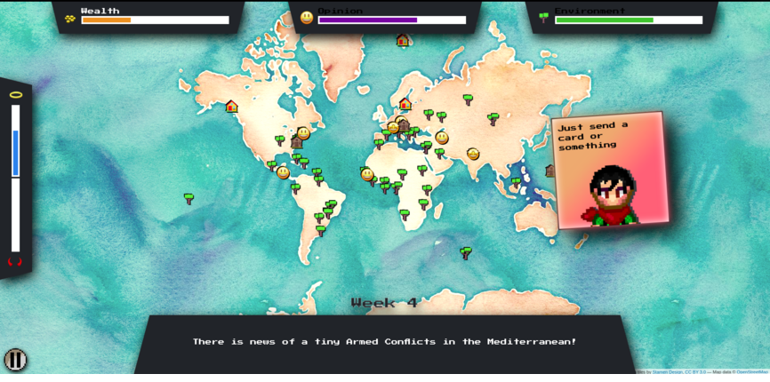
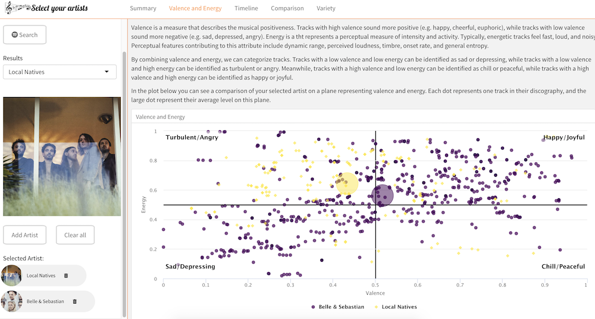
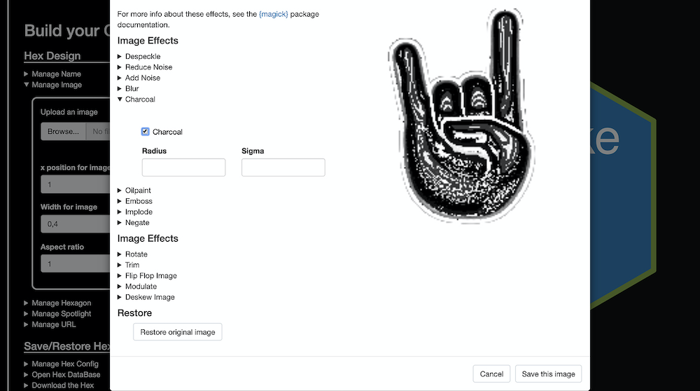
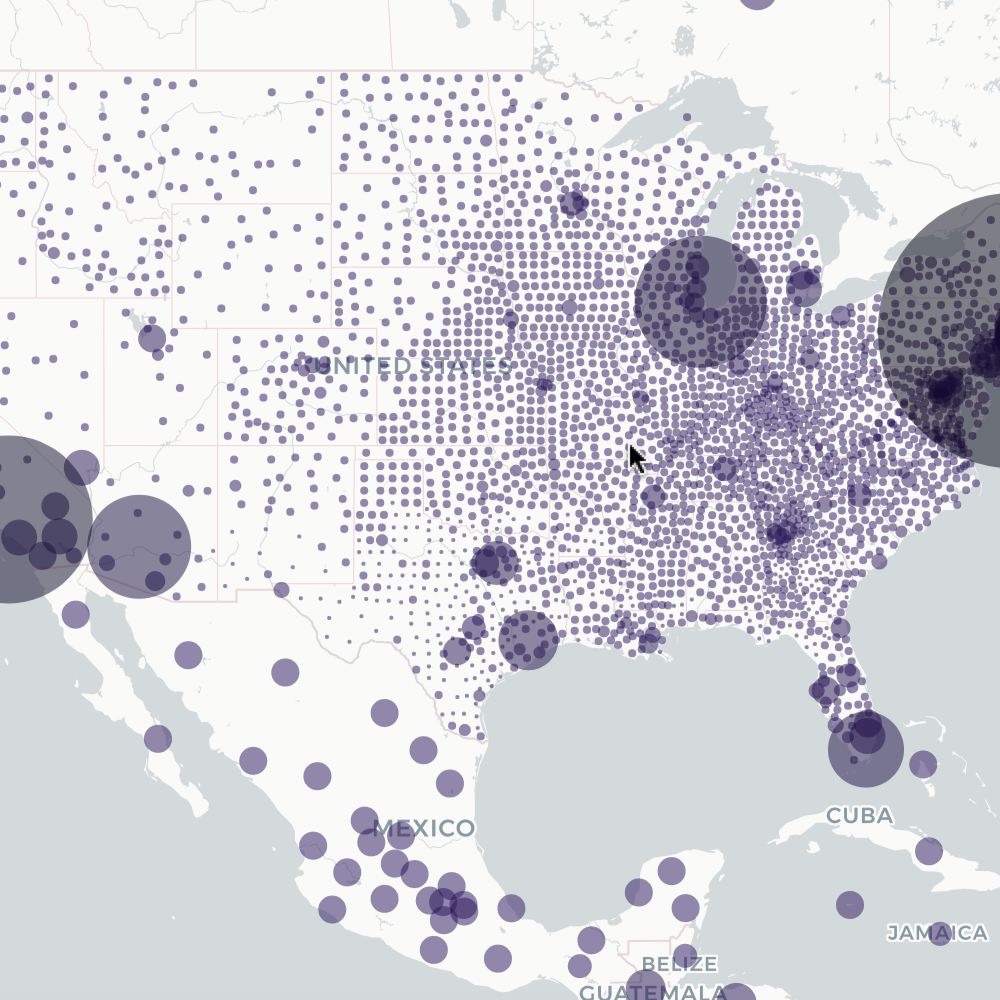
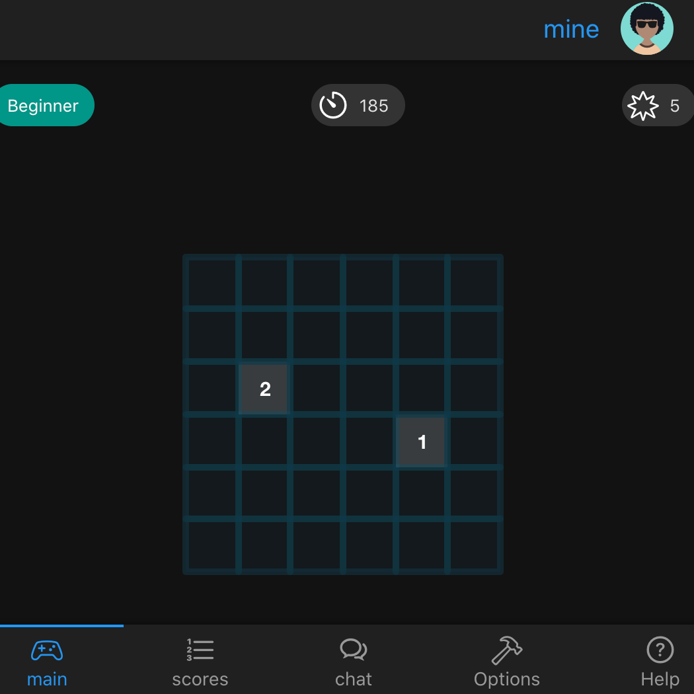
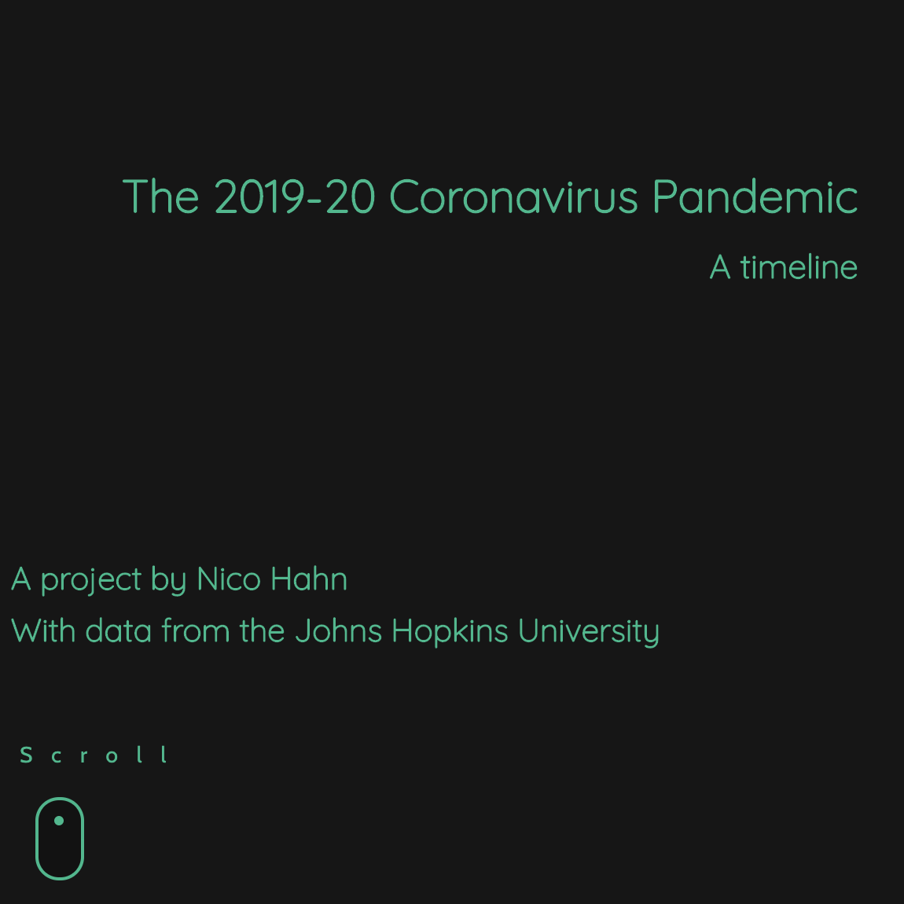

```{r setup, echo = FALSE}
knitr::opts_chunk$set(echo = FALSE, message = FALSE, warning = FALSE)
```

```{r load-packages, include=FALSE}
library(tidyverse)
library(lubridate)
library(scales)
library(DT)
library(patchwork)
```

At rstudio::conf(2020) we <a href="https://rstudio.com/resources/rstudioconf-2020/making-the-shiny-contest/" target="_blank" rel="noopener noreferrer">announced</a> the Shiny Contest 2020. Since then, lots changed in the world, and we decided to hold off on announcing the results of the contest for a bit. Today we would like to take some time to acknowledge the winners, honourable mentions, and runners up for Shiny Contest 2020.

But before that, let's start with some stats!

```{r}
contest <- read_csv("./shiny-contest-2020 - contest.csv")
n_submissions <- nrow(contest)
n_submitters  <- contest %>% distinct(user_id) %>% nrow()
n_submissions_2019 <- 136 #https://blog.rstudio.com/2019/04/05/first-shiny-contest-winners/
percent_increase <- percent((n_submissions / n_submissions_2019) - 1)
percent_novice <- contest %>% 
  count(experience) %>% 
  mutate(perc = n / sum(n)) %>% 
  filter(experience == "less than 1 year") %>% 
  pull(perc) %>% 
  percent()
```

We had `r n_submissions` submissions from `r n_submitters` unique Shiny developers to the contest this year. The number of submissions this year was `r percent_increase` higher than last year, which, frankly, contributed to the lengthy review period.

This year we announced a prize specifically for novice Shiny developers, and we are thrilled that `r percent_novice` of the submissions were from developers with less than 1 year experience with Shiny.

We were also incredibly impressed by the wide variety of application areas of the submissions. The figures below shows the distributions of categories and keywords for the app submissions. Perhaps unsurprisingly, lots of submissions involving COVID-19 data! Note that especially the categories plot likely underestimates the diversity of application areas since it can be quite difficult to classify some apps into a single category.

```{r categories-keywords, out.width="100%", include = FALSE}
# categories
rstudio_blues_palette <-  colorRampPalette(c("#75aadb", "#42709b"))
n_categories <- contest %>% distinct(category) %>% nrow()
rstudio_blues <- rstudio_blues_palette(n_categories)

p_categories <- contest %>%
  mutate(category = str_replace(category, "Government", "Govt")) %>%
  mutate(category = fct_rev(fct_infreq(category))) %>%
  ggplot(aes(y = category, fill = category)) +
  geom_bar() +
  theme_minimal() +
  scale_fill_manual(values = rstudio_blues) +
  labs(x = NULL, y = NULL,
       title = "Distribution of application areas") +
  guides(fill = FALSE)

# keywords
rstudio_greens_palette <-  colorRampPalette(c("#cbdebb", "#789d57"))
rstudio_greens <- rstudio_greens_palette(20)

p_keywords <- contest %>%
  mutate(keywords = str_split(keywords, ",")) %>%
  unnest(keywords) %>% 
  mutate(
    keywords = str_trim(keywords),
    keywords = tolower(keywords),
    keywords = str_replace(keywords, "covid19", "covid-19"),
    keywords = str_replace(keywords, "coronavirus", "covid-19")
    ) %>%
  filter(keywords != "shiny") %>%
  count(keywords, sort = TRUE) %>%
  slice_head(n = 15) %>%
  mutate(keywords = fct_reorder(keywords, n)) %>%
  ggplot(aes(y = keywords, x = n, fill = keywords)) +
  geom_col() +
  theme_minimal() +
  scale_fill_manual(values = rstudio_greens) +
  labs(x = NULL, y = NULL,
       title = "Most common keywords") +
  guides(fill = FALSE)

print(p_categories + p_keywords)
```



Apps were evaluated based on technical merit and artistic achievement. Some apps excelled in one of these categories and some in the other, and some in both. Evaluation also took into account the narrative on the contest submission post on RStudio Community.

All winners of the Shiny Contest 2020 will get one year of shinyapps.io Basic Plan, a bunch of hex stickers of RStudio packages, and a spot on the <a href="https://shiny.rstudio.com/gallery/#user-showcase" target="_blank" rel="noopener noreferrer">Shiny User Showcase</a>. Runners up will additionally get any number of RStudio t-shirts, books, and mugs (worth up to $200) where mailing is possible. And, finally, grand prize winners will additionally receive special and persistent recognition by RStudio in the form of a winners page and a badge that will be publicly visible on their <a href="http://rstudio.community/" target="_blank" rel="noopener noreferrer">RStudio Community</a> profile, as well as half-an-hour one-on-one with a representative from the RStudio Shiny team for Q&A and feedback!

Alright, without further ado, here are the winners! Note that winners are listed in no specific order within each category.

## Grand prizes

### `r emo::ji("trophy")` <a href="https://nz-stefan.shinyapps.io/blog-explorer/" target="_blank" rel="noopener noreferrer">Blog Explorer</a>

<a href="https://nz-stefan.shinyapps.io/blog-explorer/"></a>

A Shiny app to browse the results of a topic model trained on 30,000+ blog articles about the statistical programming language R. 

We loved the beautiful UI of this app that is developed using HTML templates. Topic modeling results are presented using network graphs that leverage JavaScript. The app code is clear and makes fantastic use of modules. We also enjoyed the through narrative on the submission. <a href="https://community.rstudio.com/t/blog-explorer-2020-shiny-contest-submission/58803" target="_blank" rel="noopener noreferrer">[Read more]</a>

<br>

### `r emo::ji("trophy")` <a href="https://rajkstats.shinyapps.io/git_discoverer_app/" target="_blank" rel="noopener noreferrer">Git Discoverer</a>

<a href="https://rajkstats.shinyapps.io/git_discoverer_app"></a>

This project is re-work the app author's submission for RStudio Shiny Contest 2019. The re-worked app features popular machine learning and deep learning projects on GitHub, dynamic rendering, functionality to sort by trend, stars, and forks as well as a disconnect screen for Shiny Server.

We loved that the app author re-built this app to try out skills they developed over the past year. The improvement in the UI is very striking! And the submission narrative is incredibly detailed as well! <a href="https://community.rstudio.com/t/re-work-of-gitdiscoverer-2020-shiny-contest-submission/58325" target="_blank" rel="noopener noreferrer">[Read more]</a>

<br>

### `r emo::ji("trophy")` <a href="https://sparktuga.shinyapps.io/ShinyDecisions/" target="_blank" rel="noopener noreferrer">Shiny Decisions</a>

<a href="https://sparktuga.shinyapps.io/ShinyDecisions/"></a>

A game about making the best of terrible choices. In Shiny Decisions your goal is to last as long as possible while making decisions that affect the wealth, population and environment quality in the world.

The app is quite complex, and hard to describe with words. We strongly recommend giving the game a try to get a sense of it! The code for the app is equally complex, but very well organised.

<br>

### `r emo::ji("trophy")` <a href="https://kneijenhuijs.shinyapps.io/Datify" target="_blank" rel="noopener noreferrer">Datify</a>

<a href="https://kneijenhuijs.shinyapps.io/Datify"></a>

Curious about the sentiment of your favourite artists? And how do they compare to other artists? Are specific artists changing their musical style over time? And do they vary more in their musical creativity than others? Answers to these type of questions can be found in this app that is inspired, in part, by one of last year's winning submissions, the <a href="https://community.rstudio.com/t/shiny-contest-submission-sentify-spotify-musical-sentiment-visualization/25207" target="_blank" rel="noopener noreferrer">Sentify</a> app.

We loved the clean UI of this app and the interactivity when selecting artists. The various data visualisations and the consistent use of color in them is quite striking as well! We should also note that this app won one of the Grand Prizes in the novice category with app developers having less than 1 year experience with Shiny!

<br>

### `r emo::ji("trophy")` <a href="https://connect.thinkr.fr/hexmake/" target="_blank" rel="noopener noreferrer">Hexmake</a>

<a href="https://connect.thinkr.fr/hexmake/"></a>

An application to build your own hex sticker. Allows to customise name, font, colours, to manipulate the image, to export the hex and to save it in an open hex database. 

The application area is quite straightforward but the technical details of this app are what set it apart from other apps with a similar goal. The app comes with a series of tools built on top of the magick package that allows the user to modify the image they upload to the app. It also comes with its own file format for the resulting hex and it's plugged into a Mongo database where users can save their own hexes and share it with others. It also has a nice walk through to help users get started. <a href="https://community.rstudio.com/t/hexmake-2020-shiny-contest-submission/59122" target="_blank" rel="noopener noreferrer">[Read more]</a>

<br><br>

## Runners up

<a href="https://parmsam.shinyapps.io/one_source_indy/"></a>

### `r emo::ji("medal_sports")` <a href="https://parmsam.shinyapps.io/one_source_indy/" target="_blank" rel="noopener noreferrer">One Source Indy</a>

This app uses Indianapolis community resource data to create an open source app to better inform in-need homeless or unstably-housed individuals living in Indianapolis on resources available in their community. The prototype was created to show how publicly available resource data can be used with R shiny, to potentially collaborate with Indianapolis homeless outreach organizations, and to encourage others to develop similar applications for social good.

We loved the application area of this app and that the app authors also made the webscraping code available. We were also very impressed by the complexity of the app given that the app authors had less than one year experience with Shiny. <a href="https://community.rstudio.com/t/one-source-indy-2020-shiny-contest-submission/55391" target="_blank" rel="noopener noreferrer">[Read more]</a>

<br>

<a href="https://sebastianwolf.shinyapps.io/Corona-Shiny/"></a>

### `r emo::ji("medal_sports")` <a href="https://sebastianwolf.shinyapps.io/Corona-Shiny/" target="_blank" rel="noopener noreferrer">Material Design COVID-19 Dashboard</a>

Governments and COVID-19: Which one stops it faster, better, has fewer people dying? These questions get answered in this visually appealing and mobile friendly dashboard that uses plotly and shinymaterial. <a href="https://community.rstudio.com/t/material-design-corona-covid-19-dashboard-2020-shiny-contest-submission/59690" target="_blank" rel="noopener noreferrer">[Read more]</a> 

<br><br><br><br>

<a href="https://dgranjon.shinyapps.io/deminR"></a>

### `r emo::ji("medal_sports")` <a href="https://dgranjon.shinyapps.io/deminR" target="_blank" rel="noopener noreferrer">deminR</a>

This is the R version of the Minesweeper. The goal is simple : flag all the mines as quick as possible by clicking on the grid. While this app is optimized for mobile use, it also works on desktop. Note that since the right click on desktop platforms is replaced by a long press for mobiles which takes more time, scores are categorized by devices. As soon as you click on a mine, the game is immediately lost. You may reset the game at any time when the timer is on by clicking on the option button in the navigation bar. After a success, the score may be shared on twitter (as long as you have a twitter account). <a href="https://community.rstudio.com/t/deminr-a-minesweeper-for-r-2020-shiny-contest-submission/56356" target="_blank" rel="noopener noreferrer">[Read more]</a>

<br>

<a href="https://johncoene.shinyapps.io/fopi-contest/#home"></a>

### `r emo::ji("medal_sports")` <a href="https://johncoene.shinyapps.io/fopi-contest/#home" target="_blank" rel="noopener noreferrer">Freedom of Press Index</a>

This app visualises the Freedom of Press Index. It is built using the fullPage package and presents essentially two "views": (1) to explore the progress of the index through time and (2) another to compare indices across countries. The application is packaged with golem so it can be easily shared and also comes with a docker image. <a href="https://community.rstudio.com/t/freedom-of-press-index-2020-shiny-contest-submission/55775" target="_blank" rel="noopener noreferrer">[Read more]</a>

<br><br><br><br>

<a href="https://nicohahn.shinyapps.io/covid19/"></a>

### `r emo::ji("medal_sports")` <a href="https://nicohahn.shinyapps.io/covid19/" target="_blank" rel="noopener noreferrer">Visualization of Covid-19 Cases</a>

This app takes a slightly different approach to visualizing the outbreak of the coronavirus. While the confirmed and deceased cases can still be viewed on a world map, the main goal was to tell the story of the virus. Where it came from, how it spread and what consequences it had. It is designed as a story board that is supplemented by various plots to underline the significance of different events. <a href="https://community.rstudio.com/t/visualization-of-covid-19-cases-2020-shiny-contest-submission/57211" target="_blank" rel="noopener noreferrer">[Read more]</a>

<br><br>

## Honorable mentions

`r emo::ji("sparkles")` <a href="https://scotland.shinyapps.io/sg-equality-evidence-finder/" target="_blank" rel="noopener noreferrer">Equality evidence finder</a>: The Equality Evidence Finder provides a summary of the range of available equality research and statistics for Scotland. The app currently contains over 250 interactive charts and 500 equality evidence summaries, covering a wide range of policy areas. • Data can be read directly from the Scottish Government open data platform, allowing charts to be updated automatically as soon as new data is published. <a href="https://community.rstudio.com/t/scottish-government-equality-evidence-finder-2020-shiny-contest-submission/53699" target="_blank" rel="noopener noreferrer">[Read more]</a>

`r emo::ji("sparkles")` <a href="https://dgkf.shinyapps.io/riddlr-challenge-catalog/" target="_blank" rel="noopener noreferrer">riddlr: Test-case-driven R Programming Challenges</a>: A set of shiny tools for creating coding challenges. Questions are added via a simple Rmd template , making it easy for contributors to expand the variety of questions. Metadata about the question is captured in the yaml header and named code chunks are used to capture the pre-populated code block, solution and test inputs. <a href="https://community.rstudio.com/t/riddlr-r-programming-challenges-2020-shiny-contest-submission/54078" target="_blank" rel="noopener noreferrer">[Read more]</a>

`r emo::ji("sparkles")` <a href="https://smirnovayu.shinyapps.io/hangman_en/" target="_blank" rel="noopener noreferrer">Hangman</a>: Classic hangman in Shiny! Press a letter, if it is in the word - it is added to it, if not - a picture of a hangman gets extended by one line. There is a Russian version in the app repo as well! <a href="https://community.rstudio.com/t/hangman-2020-shiny-contest-submission/54937" target="_blank" rel="noopener noreferrer">[Read more]</a>

`r emo::ji("sparkles")` <a href="https://shahreyar-abeer.shinyapps.io/life_of_pi/" target="_blank" rel="noopener noreferrer">Life of pi: A Monte Carlo simulation</a>:  A shiny app that demonstrates the use of Monte Carlo Simulation to estimate the value of $\pi$. <a href="https://community.rstudio.com/t/life-of-pi-a-monte-carlo-simulation-2020-shiny-contest-submission/59748" target="_blank" rel="noopener noreferrer">[Read more]</a>

`r emo::ji("sparkles")` <a href="https://hssgenomics.shinyapps.io/RNAseq_DRaMA/" target="_blank" rel="noopener noreferrer">rnaseqDRaMA - RNAseq data visualization and mining
</a>: RNAseq has been widely adopted as the method of choice for large-scale gene expression profiling. Data under-utilization, however remains a major challenge due to specific skill set required for data processing, interpretation, and analysis. To simplify end-user RNA-seq data interpretation, we created RNA-seq DRaMA (RNAseq Data Retrieval and Mining Analytical platform) - an R/Shiny interactive reporting system with user-friendly web interface for data exploration and visualization (https://hssgenomics.shinyapps.io/RNAseq_DRaMA/ ). The app supports many methods for data exploration including: sample PCA and multidimensional scaling, gene- and sample- correlation analyses, Venn diagram and UpSet set visualizations, gene expression group barplots and heatmaps with hierarchical clustering, volcano plots, pathway analysis with QuSAGE, and Transcription Factor network analysis. All plots are highly customized in terms of sample, feature, threshold, and color selections and create publication-ready pdf and tabular outputs. All features are well-documented with an in-app manual. RNAseq DRaMA has been extensively tested at the HSS Genomics Center with more than 100 projects delivered and several projects currently deployed in the public domain. The app comes with a manual written in bookdown! <a href="https://community.rstudio.com/t/rnaseqdrama-rnaseq-data-visualization-and-mining-2020-shiny-contest-submission/57244" target="_blank" rel="noopener noreferrer">[Read more]</a>

`r emo::ji("sparkles")` <a href="https://rafa-pereira-br.shinyapps.io/accessibilityatlas/" target="_blank" rel="noopener noreferrer">Accessibility Atlas</a>: The Accessibility Atlas is a Shiny App that allows people to interactively explore the results of the Access to Opportunities Project . It contains maps and charts that allow users to visualize estimates of people’s access to employment, education and health services at a high spatial resolution and disaggregated by socio-economic groups according to income level and color/race. In English and Portugese. <a href="https://community.rstudio.com/t/accessibility-atlas-2020-shiny-contest-submission/57337" target="_blank" rel="noopener noreferrer">[Read more]</a>

`r emo::ji("sparkles")` <a href="https://mklienz.shinyapps.io/dude-wmb/" target="_blank" rel="noopener noreferrer">Dude Where’s my Bus</a>: This Shiny application provides the user with a series of tools to inform them about the location and due times of buses and trains at multiple stops and positions in Auckland, New Zealand, helping to answer the question posed by the app's title - Dude, Where's My Bus? The app features multiple real time boards, live bus locations, and functionality to find an ideal bus stop. <a href="https://community.rstudio.com/t/dude-wheres-my-bus-2020-shiny-contest-submission/56634" target="_blank" rel="noopener noreferrer">[Read more]</a>

`r emo::ji("sparkles")` <a href="https://pachamaltese.shinyapps.io/tradestatistics" target="_blank" rel="noopener noreferrer">Trade Statistics</a>: Open Trade Statistics is a project that includes a public API, a dashboard, and an R package for data retrieval. In particular, the dashboard was conceived as a graphical tool for people from economics and humanities that, most of the times, are used to Excel and not to using APIs. The dashboard allows users to explore the data visually and then export it to xlsx and other formats. App was reviewed by rOpenSci as well! <a href="https://community.rstudio.com/t/tradestatistics-2020-shiny-contest-submission/53917" target="_blank" rel="noopener noreferrer">[Read more]</a>

<br>

## All submissions to Shiny Contest 2020

Feel free to peruse <a href="https://rpubs.com/minebocek/shiny-contest-2020-submissions" target="_blank" rel="noopener noreferrer">the full list of all submissions to the contest</a> with links to the apps along with the submission narratives on RStudio Community. Note that data and code used in the apps are all publicly available and/or openly licensed. We hope that they will serve as inspiration for your next Shiny app!


