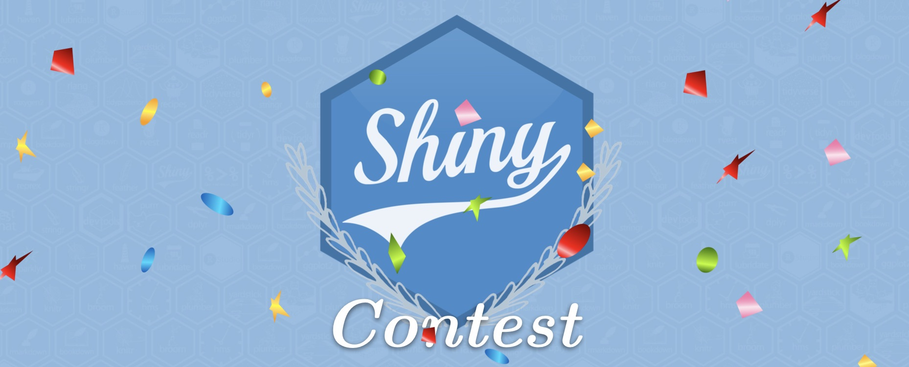
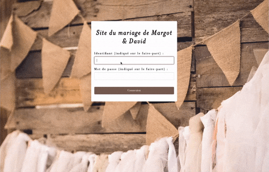
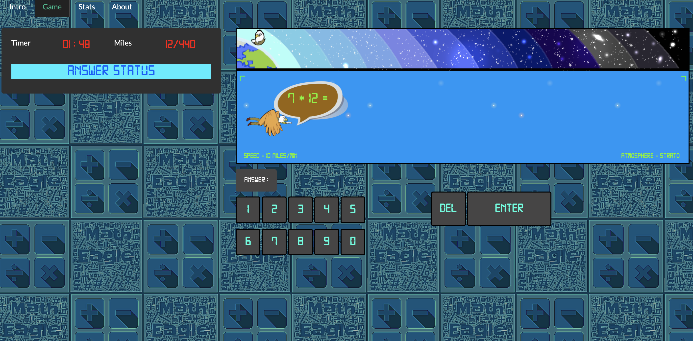
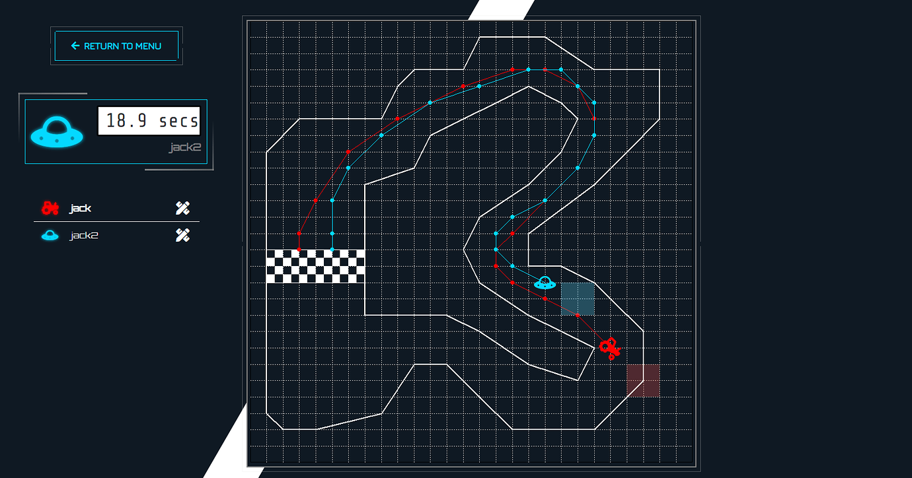
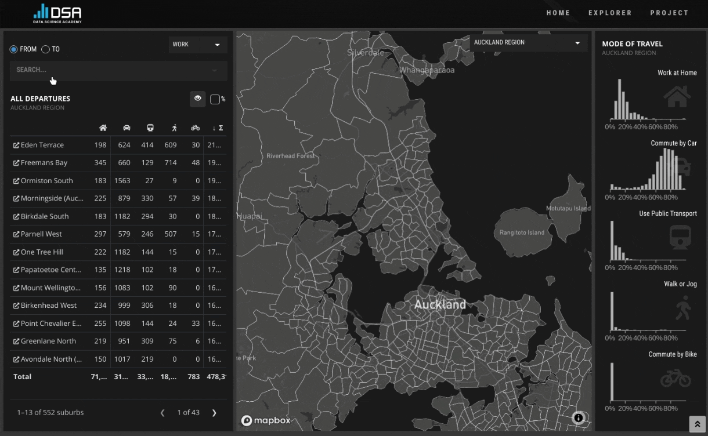
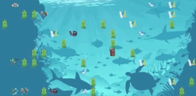
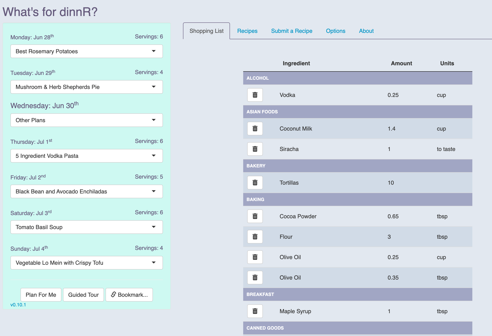
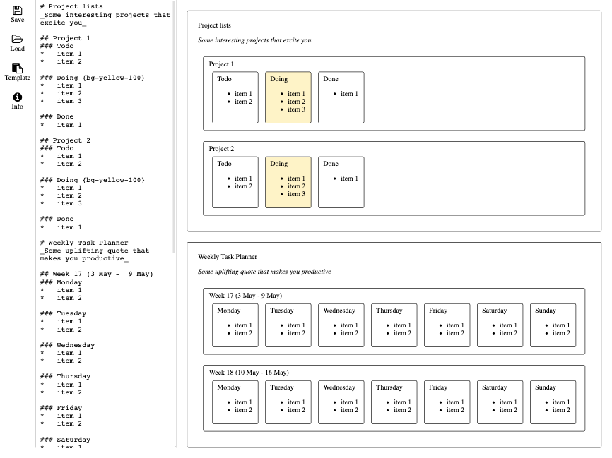

Once again the Shiny community has wowed us with their contributions to the 3rd annual Shiny Contest that we <a href = "https://blog.rstudio.com/2021/03/11/time-to-shiny/">announced back in March 2021</a>.

We had 179 submissions from 164 unique Shiny developers to the contest this year over the two-month period submission period for the contest, with over 40% of participants indicating that they have less than one year experience with Shiny!

# Evaluation and judging

Apps were evaluated based on technical merit and artistic achievement.
Some apps excelled in one of these categories and some in the other, and some in both.
Evaluation also took into account the narrative on the contest submission post on RStudio Community.

Before we go on to announcing the winners, we would like to thank our esteemed judges who helped us evaluate the submissions.
A huge thanks to <a href='https://community.rstudio.com/u/csoneson' target = '_blank'>Charlotte Soneson</a>, <a href='https://community.rstudio.com/u/colin' target = '_blank'>Colin Fay</a>, <a href='https://community.rstudio.com/u/EconomiCurtis' target = '_blank'>Curtis Kephart</a>, <a href='https://community.rstudio.com/u/dgranjon' target = '_blank'>David Granjon</a>, <a href='https://community.rstudio.com/u/committedtotape' target = '_blank'>David Smale</a>, <a href='https://community.rstudio.com/u/rpodcast' target = '_blank'>Eric Nantz</a>, <a href='https://community.rstudio.com/u/federicomarini' target = '_blank'>Federico Marini</a>, <a href='https://community.rstudio.com/u/grrrck' target = '_blank'>Garrick Aden-Buie</a>, <a href='https://community.rstudio.com/u/rstudiojoe' target = '_blank'>Joe Rickert</a>, <a href='https://community.rstudio.com/u/johncoene' target = '_blank'>John Coene</a>, <a href='https://community.rstudio.com/u/kevinrue' target = '_blank'>Kevin Rue</a>, <a href='https://community.rstudio.com/u/kneijenhuijs' target = '_blank'>Koen Neijenhuijs</a>, <a href='https://community.rstudio.com/u/mayagans' target = '_blank'>Maya Gans</a>, <a href='https://community.rstudio.com/u/nsgrantham' target = '_blank'>Neal Grantham</a>, <a href='https://community.rstudio.com/u/nicohahn' target = '_blank'>Nico Hahn</a>, <a href='https://community.rstudio.com/u/pedrocoutinhosilva' target = '_blank'>Pedro Silva</a>, <a href='https://community.rstudio.com/u/rajk' target = '_blank'>Raj Kumar</a>, <a href='https://community.rstudio.com/u/parmsam' target = '_blank'>Sam Parmar</a>, <a href='https://community.rstudio.com/u/samanthatoet' target = '_blank'>Sam Toet</a>, and <a href='https://community.rstudio.com/u/winston' target = '_blank'>Winston Chang</a> for their help in evaluating the submissions and thoughtful comments.

A few of these judges have submitted apps to the contest as well, which have been omitted from the evaluation but we'd love to take a moment to highlight them here!

-   <a href = "https://nicohahn.shinyapps.io/spotify_habits/" target = "_blank">Spotify Habits</a> by Nico Hahn: A small app showing what music Nico listens to on Spotify in general and what they have been listening to more recently. The all also presents analysis on the artists and songs. Read more about the app <a href = 'https://community.rstudio.com/t/spotify-habits-shiny-contest-submission/102934' target = '_blank'>here</a>.
-   <a href = "https://parmsam.shinyapps.io/MixThingsUp/" target = "_blank">Mix Things Up</a> by Sam Parmar: An app to quickly generate random workout plans from a list of exercises. Features the use of the <a href = "https://gt.rstudio.com/" target = "_blank">gt</a> and <a href = "https://rstudio.github.io/bslib/" target = "_blank">bslib</a> packages as well as publishing Google Sheets for import into Shiny. You can use the app or source code to generate your random workout plan (based on a preset list of exercises). Get after it! Read more about the app <a href = 'https://community.rstudio.com/t/mix-things-up-a-random-workout-plan-generator-shiny-contest-submission/103530' target = '_blank'>here</a>.
-   <a href = "https://rpodcast.shinyapps.io/hotshot_dashboard" target = "_blank">The Hotshots Racing Dashboard!</a> by Eric Nantz: In Eric's words "a completely over-the-top" dashboard summarizing the Wimpy's World Hotshot Racing 2021 spring virtual racing league. The dashboard contains interactive tables powered by <a href = "https://glin.github.io/reactable/" target = "_blank">reactable</a> and interactive visualizations from <a href = "https://echarts4r.john-coene.com/" target = "_blank">echarts4r</a> and <a href = "https://plotly.com/r/getting-started/" target = "_blank">plotly</a>!" Read more about the app <a href = 'https://community.rstudio.com/t/the-hotshots-racing-dashboard-shiny-contest-submission/104925' target = '_blank'>here</a>.
-   <a href = "https://rpodcast.shinyapps.io/hotshot_random" target = "_blank">Hotshots Racing Random Driver & Car App!</a> also by Eric Nantz: A random car and driver selector used in the Wimpy's World Hotshot Racing 2021 spring virtual racing league. Simply click the Launch button to kick off a Vegas-style carousel! Read more about the app <a href = 'https://community.rstudio.com/t/hotshots-racing-random-driver-car-app-shiny-contest-submission/104927' target = '_blank'>here</a>.

All winners of the Shiny Contest 2021 will get one year of shinyapps.io Basic Plan, a bunch of hex stickers of RStudio packages, and a spot on the Shiny User Showcase.
Runners up will additionally get any number of RStudio t-shirts, books, and mugs (worth up to \$200) where mailing is possible.
And, finally, grand prize winners will additionally receive special and persistent recognition by RStudio in the form of a winners page and a badge that will be publicly visible on their RStudio Community profile, as well as half-an-hour one-on-one with a representative from the RStudio Shiny team for Q&A and feedback!

Without further ado, here are the winners!
We have categorized runners up and grand prize winners based on whether they have less or more than one year experience with Shiny.
Note that winners are listed in no specific order within each category.

# Grand prizes

## Less than one year experience

### 🏆 <a href = "https://connect.thinkr.fr/wedding" target = "_blank">{wedding}: a Shiny app to help future grooms</a>

by <a href = 'https://community.rstudio.com/u/MargotBrd' target = '_blank'>Margot Brard</a>

Guests can get logistical information about the wedding, confirm their attendance, and indicate their menu choice.
The future bride and groom have access the wedding dashboard (visualization of expenses, number of confirmations, seating charts, ...).
Read more about the app <a href = 'https://community.rstudio.com/t/wedding-a-shiny-app-to-help-future-grooms-shiny-contest-submission/104657' target = '_blank'>here</a>.

The judges loved this novel approach to a very real problem (terrible wedding websites!) and especially enjoyed the table setting plans in the bride and groom only area.

### 🏆 <a href = "https://sharukkhanstat777.shinyapps.io/MathEagleGame/" target = "_blank">Math Eagle Game</a>

by <a href = 'https://community.rstudio.com/u/Sharukkhan' target = '_blank'>Sharukkhan</a>

When the user clicks on START, the page directs to a mathematical game.
The objective of the game is to make the math eagle reach outer space.
For each correct or incorrect answer, the user is notified and the speed changes accordingly.
After completing 2 minutes, the page directs to Scoreboard, where the player can view the scores as well as highlights.
Read more about the app <a href = 'https://community.rstudio.com/t/math-eagle-game-shiny-contest-submission/104836' target = '_blank'>here</a>.

The judges thought this was a very fun take on a math game for kids.
They loved the technical implementation of this application with proper use of functions to reduce the codebase, and very proper use of reactivity and remarked that this was particularly impressive for someone relatively new to Shiny!

### 🏆 <a href = "https://neoxone.shinyapps.io/BCGOV_CCISS" target = "_blank">Shiny app for climate change informed tree species selection</a>

by <a href = 'https://community.rstudio.com/u/meztez' target = '_blank'>Bruno Tremblay</a>

Use map or table to enter points of interest.
Information for each point is retrieved from a Postgis backend.
Click Generate to produce a series of information detailing each site tree species feasibility, including modelled future predictions.
Read more about the app <a href = 'https://community.rstudio.com/t/shiny-app-for-climate-change-informed-tree-species-selection-shiny-contest-submission/99916' target = '_blank'>here</a>.

The judges thought the app showed high technical rigor, and especially highlighted that it's structured as a package.
Not only is the reactive functionality in the app is smooth, it's also robust to errors with gentle fail mechanisms vs. crashing the app!

## More than one year experience

### 🏆 <a href = "https://jpd527.shinyapps.io/racetrack/" target = "_blank">Racetrack 2: Electric Boogaloo</a>

by <a href = 'https://community.rstudio.com/u/jdeweese' target = '_blank'>Jackson DeWeese</a> and <a href = 'https://community.rstudio.com/u/dfrye' target = '_blank'>Darren Frye</a>

A digital version of the paper & pencil game Racetrack taken from its start on graph paper in the ‘60s to an online click-to-drive game, Racetrack 2: Electric Boogaloo uses Shiny’s reactivity with global variables to create a multiplayer experience. Read more about the app <a href = 'https://community.rstudio.com/t/racetrack-2-electric-boogaloo-shiny-contest-submission/104522' target = '_blank'>here</a>.

The judges loved the fun factor of this app, the multi-player logic, and the slick authentication! 

### 🏆 <a href = "https://nz-stefan.shinyapps.io/commute-explorer-2/" target = "_blank">Commute Explorer</a>

by <a href = 'https://community.rstudio.com/u/nz-stefan' target = '_blank'>Stefan Schliebs</a>

This project explores the commuting behavior of New Zealanders based on the Stats NZ Census 2018 data set. The app uses a custom HTML template to present commuting figures on a map, mode of travel visualizations, work and education related commuting and various filtering options. Read more about the app <a href = 'https://community.rstudio.com/t/commute-explorer-shiny-contest-submission/104651' target = '_blank'>here</a>.

The judges remaked that "this app is GORGEOUS"! Via the use of an HTML template, the app looks nothing like a standard Shiny app. Plug and play: it's very simple to understand what it does!

### 🏆 <a href = "https://mdubel.shinyapps.io/shark-attack/" target = "_blank">Shark Attack</a>

by <a href = 'https://community.rstudio.com/u/mdubel' target = '_blank'>Marcin Dubel</a>

The ocean is the origin and the engine of all life on this planet — and it is under threat. The game goal is to spread the awareness of the environmental issues via enjoyable way. The user will try to collect as much trash as possible while avoiding sharks. Read more about the app <a href = 'https://community.rstudio.com/t/shark-attack-shiny-contest-submission/104695' target = '_blank'>here</a>.

The judges thought this was a really neat implementation of a motivating and fun teaching tool. (Side note: My four year old LOVES this app! Unfortunately, now he thinks all I do on my computer when I'm working is playing the shark game...)

### 🏆 <a href = "https://jpd527.shinyapps.io/racetrack/" target = "_blank">dinnR</a>

by <a href = 'https://community.rstudio.com/u/koderkow' target = '_blank'>Kyle Harris</a> and <a href = 'https://community.rstudio.com/u/actualtoilet' target = '_blank'>Alexis Meskowski</a>

The dinnR app is a weekly meal planning app for dinner. Simply pick your meals from a community-driven database of recipes, and dinnR will generate a list of items needed for the week. Remove ingredients you have at home and the remaining ingredients can be used as a shopping list. Links are provided to each recipe along with credit to the user that submitted them. The options tab allows you to change the planning dates, set a measurement system, and filter by dietary restrictions. The "Submit a Recipe" tab lets the user submit recipes they enjoy to the app where we credit them. Read more about the app <a href = 'https://community.rstudio.com/t/dinnr-shiny-contest-submission/104773' target = '_blank'>here</a>.

The judges thought the idea of the app is really fun and were impressed by the participation from the twitch audience filling in the data -- the developers stream on <a href = "https://www.twitch.tv/theeatgamelove" target = "_blanl">twitch.tv</a>, and among other things, they stream coding sessions on Saturday mornings! The judges also commented that the code is super clean and very impressive (with the use of Shiny modules and organization as an R package).

### 🏆 <a href = "https://jksserver.shinyapps.io/shiny_markdown_organiser/" target = "_blank">A minimalist Markdown organiser</a>

by <a href = 'https://community.rstudio.com/u/jacksonkwok' target = '_blank'>Chun Fung Kwok</a>

Type Markdown in the textbox on the left, see rendered organiser on the right. "Click" an item/card on the board to edit the text, and "Drag" to move the items/cards around to desired location. Updates are bidirectional.
Read more about the app <a href = 'https://community.rstudio.com/t/a-minimalist-markdown-organiser-shiny-contest-submission/104025' target = '_blank'>here</a>.

The judges love the minimalistic design of this app and how the developers integrated lots of cool JS!

# Runners up

- <a href = "https://jiddualexander.shinyapps.io/svg_input/" target = "_blank">SVG Input</a> by <a href = 'https://community.rstudio.com/u/JidduAlexander' target = '_blank'>Jiddu Alexander</a>.
The judges really loved the functionality and the layout of this app as well as the well-organized code.
A very neat tool for all Shiny developers!

- <a href = "https://rosemarysu.shinyapps.io/bolivia_unpaid_labor/" target = "_blank">Living a life of labor in Bolivia</a> by <a href = 'https://community.rstudio.com/u/rosemarysu'>Rui Su</a> and Carla Cristina Solis Uehara.
The judges highlighted the ease of use of this app and the inspiring topic.

- <a href = "https://tgirke.shinyapps.io/systemPipeShiny/" target = "_blank">systemPipeShiny</a> by <a href = 'https://community.rstudio.com/u/lz100' target = '_blank'>Le Zhang</a>. 
The judges thought this app is brilliantly put together and commented "I can't wrap my head around how much functionality this app has implemented!". Read more about the app <a href = 'https://community.rstudio.com/t/systempipeshiny-shiny-contest-submission/103392' target = '_blank'>here</a>.

- <a href = "https://niels-van-der-velden.shinyapps.io/shinyNGLVieweR/" target = "_blank">Three dimensional (3D) interactive visualization of protein structures</a> by <a href = 'https://community.rstudio.com/u/noveld' target = '_blank'>Niels van der Velden</a>.
The judges thought the app is very well explained in contest submission and really polished. 
They also commented on the neat organization of the code and the use of Shiny modules.

- <a href = "https://2exp3.shinyapps.io/mapa-ciclista/" target = "_blank">Bikemapp</a> by <a href = 'https://community.rstudio.com/u/agus' target = '_blank'>Agustin Perez Santangelo</a>.
The were impressed by the snazzy UI of this app and how the author collated data from different sources to provide cyclists a map that provides all essential information they will need while riding.
They commented that the concept behind the app is unique and UI is pretty pleasant and enhances overall experience and the code follows best practices.

# Honorable mentions

- <a href = 'https://community.rstudio.com/t/greent-shiny-contest-submission/104204' target = '_blank'>greenT</a> by Kaija Gahm.
- <a href = 'https://community.rstudio.com/t/wildlift-an-open-source-tool-to-guide-decisions-for-wildlife-conservation-shiny-contest-submission/102498' target = '_blank'>WildLift: An open-source tool to guide decisions for wildlife conservation</a> by Sólymos, P., Nagy-Reis, M., Dickie, M., Gilbert, S. and Serrouya, R..
- <a href = 'https://community.rstudio.com/t/chess-com-dashboard-shiny-contest-submission/98735' target = '_blank'>Chess(.com) Dashboard</a> by Claudio Paladini.
- <a href = 'https://community.rstudio.com/t/fairsplit-shiny-contest-submission/104752' target = '_blank'>FairSplit</a> by Douglas R. Mesquita Azevedo and Luís Gustavo Silva e Silva.
- <a href = 'https://community.rstudio.com/t/geomapx-shiny-contest-submission/104901' target = '_blank'>geoMapX</a> by Camill.
- <a href = 'https://community.rstudio.com/t/healthdown-shiny-contest-submission/104784' target = '_blank'>healthdown</a> by Peter Gandenberger and Andreas Hofheinz.
- <a href = 'https://community.rstudio.com/t/hong-kong-district-councillors-shiny-contest-submission/104810' target = '_blank'>Hong Kong District Councillors</a> by Avision Ho, Martin Chan, and Gabriel Tam.
- <a href = 'https://community.rstudio.com/t/science-pulse-shiny-contest-submission/104880' target = '_blank'>Science Pulse</a> by Sérgio Spagnuolo, Lucas Gelape, Rodolfo Almeida, Renata Hirota, Jade Drummond, and Felippe Mercurio.
- <a href = 'https://community.rstudio.com/t/cbm-at-home-shiny-contest-submission/102596' target = '_blank'>CBM at Home</a> by Lillian Durán, Norma Medina, Yaacov Petscher, Marissa Suhr, and A.J. Torgesen.
- <a href = 'https://community.rstudio.com/t/steam-explorer-shiny-contest-submission/104606' target = '_blank'>Steam Explorer</a> by Raphael Guyot.
- <a href = 'https://community.rstudio.com/t/piano-journal-past-present-and-future-3-5-years-shiny-contest-submission/104834' target = '_blank'>Piano Journal: Past, Present and Future - 3.5 years</a> by Peter Hontaru.

# All submissions to Shiny Contest 2021

Feel free to peruse the full list of all submissions to the contest on <a href = "https://community.rstudio.com/tag/shiny-contest-2021" target = "_blank">RStudio Community</a>.
Note that data and code used in the apps are all publicly available and/or openly licensed.
We hope that they will serve as inspiration for your next Shiny app!
