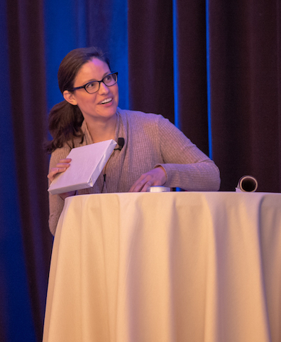

Last month our team assembled from 26 states and seven countries in Columbus, OH for our company Work Week. Though plain in name, this week is anything but. It is filled with stories, homemade goodies, big laughs, new experiences and lots of in-depth conversations. The layout varies a bit year to year but the same is true - each and every time we connect, communicate, and get things done!

Some highlights this year included, hex cookies made by [Sooner Sugar](https://soonersugar.com/), jam sessions in the lobby, hearing from J.J. and Tareef, and five minute lightning talks given by our employees! It is fun to see our team members showcase their talents, whether it is wrapping or rapping.

Thanks to the [The Westin Great Southern Columbus](https://www.marriott.com/hotels/travel/cmhwi-the-westin-great-southern-columbus/) for making our stay so warm and welcoming. Elsie and her team were attentive, kind and available for any requests that came their way. It was beyond exceptional customer service! Our specific food requests along with our unusual IT needs were handled with ease and smiles (Thanks Robert & Cory!). Our own Kaitlyn Horwitz also did a fantastic job planning end to end and coordinating all the details. We are thankful for all the effort she put in to make it special!

We are grateful for another successful Work Week, and the chance to spend time with each other. We are looking forward to next year and who knows, maybe you could [join us](https://www.rstudio.com/about/careers/)! 

Photo credit: Wes McKinney and Clay Walker

