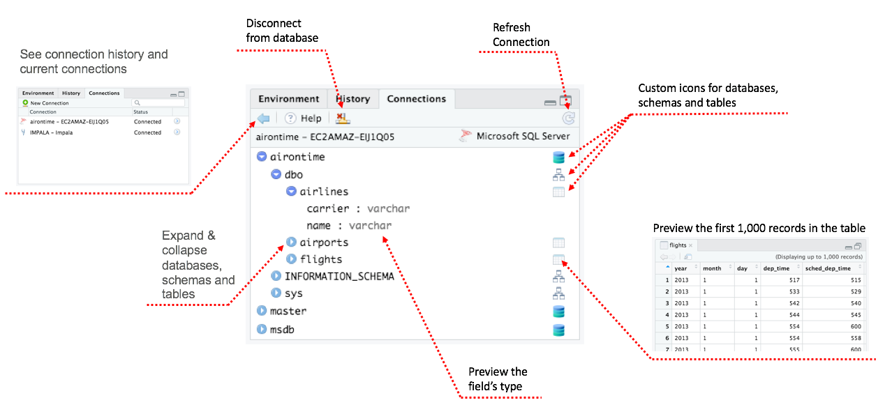
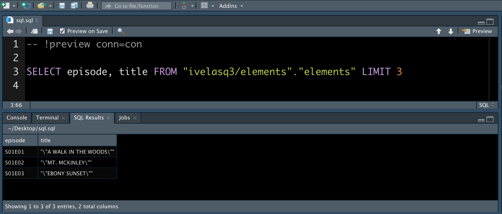
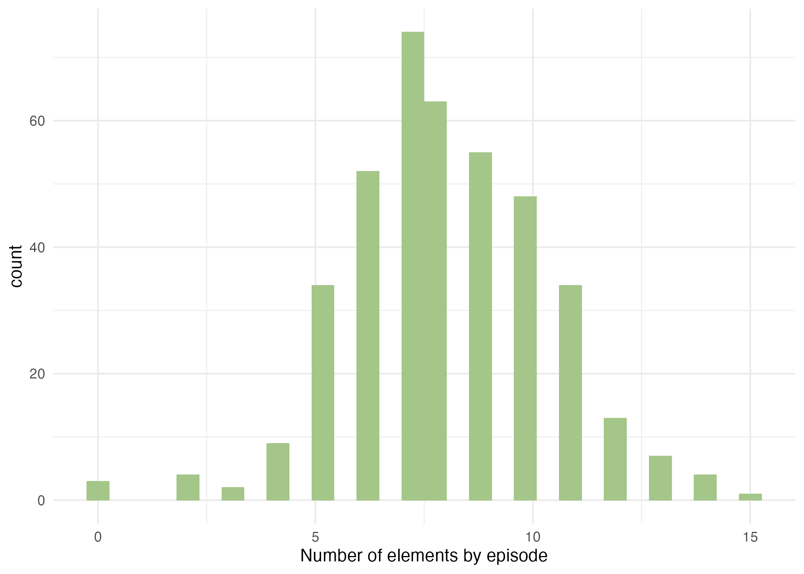

Photo by <a href="https://unsplash.com/@choys_?utm_source=unsplash&utm_medium=referral&utm_content=creditCopyText">Conny Schneider</a> on <a href="https://unsplash.com/">Unsplash</a>

Relational databases are a common way to store information, and SQL is a widely-used language for managing data held in these systems. RStudio provides several options to work with these crucial tools.

Let's explore using a <a href="https://bit.io/ivelasq3/elements" target = "_blank">PostgreSQL database</a> that contains <a href="https://github.com/fivethirtyeight/data/tree/master/bob-ross" target = "_blank">FiveThirtyEight’s data on Bob Ross paintings</a>.

## Connecting to Databases With RStudio

You can connect to databases in RStudio, either by manually writing the connection code or using the Connections Pane.

Install the packages that correspond to your database. For example, you can connect to a bit.io PostgreSQL database by creating an <a href="https://bit.io/" target = "_blank">account</a> and inserting the repo's details in a code chunk:

```{{r}}
# Install these packages if you have not already
# install.packages(c('DBI', 'RPostgres'))

con <- DBI::dbConnect(
  RPostgres::Postgres(),
  dbname = 'ivelasq3',
  host = 'db.bit.io',
  port = 5432,
  user = 'ivelasq3_demo_db_connection',
  password = Sys.getenv('BITIO_KEY') # insert your password here
)
```

In addition to manually writing code, you can connect to databases with the Connections Pane in the IDE. It shows all the connections to supported data sources. You can also scan through your databases, see which connections are currently active, and close connections.


<center><caption><a href="https://db.rstudio.com/tooling/connections/" target = "_blank">RStudio IDE Connections Pane</a></caption></center>

For RStudio commercial customers, we offer <a href="https://www.rstudio.com/products/drivers/" target = "_blank">RStudio Professional ODBC Drivers</a>. These are ODBC data connectors that help you connect to some of the most popular databases and use them in a production environment.

## Querying Databases Using RStudio

Once you have your connection set up, you can run database queries in RStudio. There are several ways of doing this. Let’s explore RStudio's SQL integration, the <a href="https://cran.r-project.org/web/packages/DBI/index.html" target = "_blank">DBI package</a>, the <a href="https://dbplyr.tidyverse.org/" target = "_blank">dbplyr package</a>, and <a href="https://rmarkdown.rstudio.com/" target = "_blank">R Markdown</a>.

## SQL Integration in RStudio

The RStudio IDE has direct integration with `.sql` files. You can open, edit, and test those file types inside RStudio.

Generate a `.sql` file with your open connection (or go to **File**, **New File**, **SQL Script**) and start writing your query.

Notice that there’s a comment RStudio added to the top of the file:

```{{r}}
-- !preview conn=con
```

This comment tells RStudio to execute the query against the open connection named `con`. Click **Preview** or press <kbd>Ctrl</kbd> + <kbd>Shift</kbd> + <kbd>Enter</kbd> to run the query, and your results appear in a new tab:



### The DBI package

You can query your data with the `DBI::dbGetQuery()` function.  Paste your SQL code as a quoted string. Using the example database from earlier, let’s query the first three rows of the `elements` table:

```{{r}}
DBI::dbGetQuery(con, 'SELECT episode, title FROM \"ivelasq3/elements\".\"elements\" LIMIT 3')
```
```
  episode                       title
1  S01E01 "\\"A WALK IN THE WOODS\\""
2  S01E02        "\\"MT. MCKINLEY\\""
3  S01E03        "\\"EBONY SUNSET\\""
```

The <a href="https://glue.tidyverse.org/" target = "_blank">glue package</a> package makes writing SQL queries a little easier. The `glue::glue_sql()` function is able to handle the SQL quoting and variable placement:

```{{r}}
tbl_glue <-
  glue::glue_sql('SELECT episode, title FROM "ivelasq3/elements"."elements" LIMIT 3')

DBI::dbGetQuery(con, tbl_glue)
```
```
  episode                       title
1  S01E01 "\\"A WALK IN THE WOODS\\""
2  S01E02        "\\"MT. MCKINLEY\\""
3  S01E03        "\\"EBONY SUNSET\\""
```

### The dbplyr package

You can write your queries with dplyr syntax using the <a href="https://dbplyr.tidyverse.org/" target = "_blank">dbplyr package</a>.

```{{r}}
library(dplyr)

tbl_dbplyr <-
  tbl(con, dbplyr::ident_q('"ivelasq3/elements"."elements"'))
```

The dbplyr package translates dplyr verbs into SQL queries, making it easy to work with the data from your database. 

```{{r}}
tbl_dbplyr %>%
  summarise(total = n())
```
```
# Source:   lazy query [?? x 1]
# Database: postgres [ivelasq3_demo_db_connection@db.bit.io:5432/ivelasq3]
    total
  <int64>
1     403
```

You can always inspect the SQL translation with the `show_query()` function.  The dbplyr package will switch between SQL syntaxes based on the DB type (e.g., MS, Oracle, PG, etc.).

```{{r}}
tbl_dbplyr %>%
  summarise(total = n()) %>% 
  show_query()
```
```
<SQL>
SELECT COUNT(*) AS "total", TRUE AS "na.rm"
FROM "ivelasq3/elements"."elements"
```

The dbplyr package allows you to work iteratively like you would in dplyr. All of your code is in R so you do not have to switch between languages to explore the data.

```{{r}}
tbl_dbplyr2 <-
  tbl_dbplyr %>%
  mutate(night_and_ocean =
    case_when(night == 1 & ocean == 1 ~ 1,
              TRUE ~ 0))

tbl_dbplyr2 %>% 
  summarise(night_sum = sum(night),
            ocean_sum = sum(ocean),
            night_and_ocean_sum = sum(night_and_ocean))
```
```
# Source:   lazy query [?? x 3]
# Database: postgres [ivelasq3_demo_db_connection@db.bit.io:5432/ivelasq3]
  night_sum ocean_sum night_and_ocean_sum
      <dbl>     <dbl>               <dbl>
1        11        36                   4
```

Using the function `collect()`, we can then use our data with other functions or R packages such as ggplot2.

```{{r}}
library(ggplot2)

tbl_ggplot <-
  tbl_dbplyr %>%
  collect() %>% 
  rowwise() %>% 
  mutate(total_number =
         as.numeric(sum(c_across(where(is.numeric))))) %>% 
  ggplot(aes(total_number)) +
  geom_histogram(fill = "#A4C689") +
  theme_minimal() +
  xlab("Number of elements by episode")
```



### R Markdown

Would you rather write verbatim SQL code? You can run SQL code in an R Markdown document. Create a `sql` code chunk and specify your connection with the `connection = con` code chunk option. 

````
```{{sql}}
#| connection = con
SELECT episode, title
FROM "ivelasq3/elements"."elements"
LIMIT 3
```
````
<div class="knitsql-table">
<table>
<caption><span id="tab:unnamed-chunk-8">Table 1: </span>3 records</caption>
<thead>
<tr class="header">
<th align="left">episode</th>
<th align="left">title</th>
</tr>
</thead>
<tbody>
<tr class="odd">
<td align="left">S01E01</td>
<td align="left">“"A WALK IN THE WOODS"”</td>
</tr>
<tr class="even">
<td align="left">S01E02</td>
<td align="left">“"MT. MCKINLEY"”</td>
</tr>
<tr class="odd">
<td align="left">S01E03</td>
<td align="left">“"EBONY SUNSET"”</td>
</tr>
</tbody>
</table>
</div>

R Markdown provides options that simplify using SQL with R. For example, <a href="https://community.rstudio.com/t/rmd-file-with-embedded-sql-chunk-possible-to-move-the-sql-to-external-file-then-source/49651" target = "_blank">this post</a> shows how you can use the `cat` engine to write the content of a chunk to a file.

````
```{{cat}}
#| engine.opts = list(file = "select_tbl.sql", lang = "sql")
SELECT episode, title
FROM "ivelasq3/elements"."elements"
LIMIT 3
```
````

You can read in the file using the `code` chunk option so you do not have to write out your SQL query.

````
```{{sql}}
#| connection = con, code=readLines("select_tbl.sql")
```
````

You can send the query output to an R data frame by defining `output.var` in the code chunk. Then you can reuse that data frame elsewhere in your code.

````
```{{sql}}
#| connection = con,
#| code=readLines("select_tbl.sql"), 
#| output.var = "dat"
```
````

````
```{{r}}
print(dat)
```
````
```
  episode                       title
1  S01E01 "\\"A WALK IN THE WOODS\\""
2  S01E02        "\\"MT. MCKINLEY\\""
3  S01E03        "\\"EBONY SUNSET\\""
```

These options make working with SQL in R Markdown even smoother.

## Learn More

This blog post just touched on a few examples of how to work with databases and SQL in RStudio. Check out more resources below.

* Read how to use RStudio products and packages with databases on our website, <a href="https://db.rstudio.com/" target = "_blank">https://db.rstudio.com/</a>. This comprehensive website provides more information on working with databases in RStudio as well as examples of best practices.
* Learn more about <a href="https://www.rstudio.com/blog/rstudio-1-2-preview-sql/" target = "_blank">RStudio's SQL integration</a>.
* Explore the powerful package <a href="https://dbplyr.tidyverse.org/" target = "_blank">dbplyr</a>.
* Find out more about the <a href="https://bookdown.org/yihui/rmarkdown/language-engines.html#sql" target = "_blank">SQL engine in R Markdown</a>.
* Check out some great talks by <a href="https://www.youtube.com/watch?v=gdzONbwfWk0" target = "_blank">Irene Steves</a>, <a href="https://www.youtube.com/watch?v=JwP5KdWSgqE" target = "_blank">Ian Cook</a>, and <a href="https://www.youtube.com/watch?v=aVI4YZ1CB2c" target = "_blank">Edgar Ruiz</a>.
