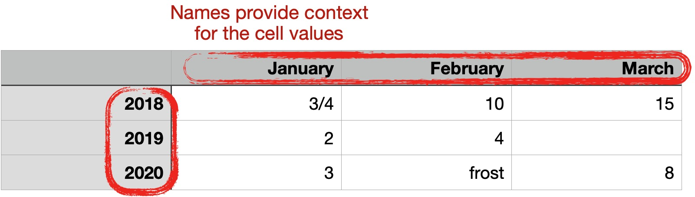
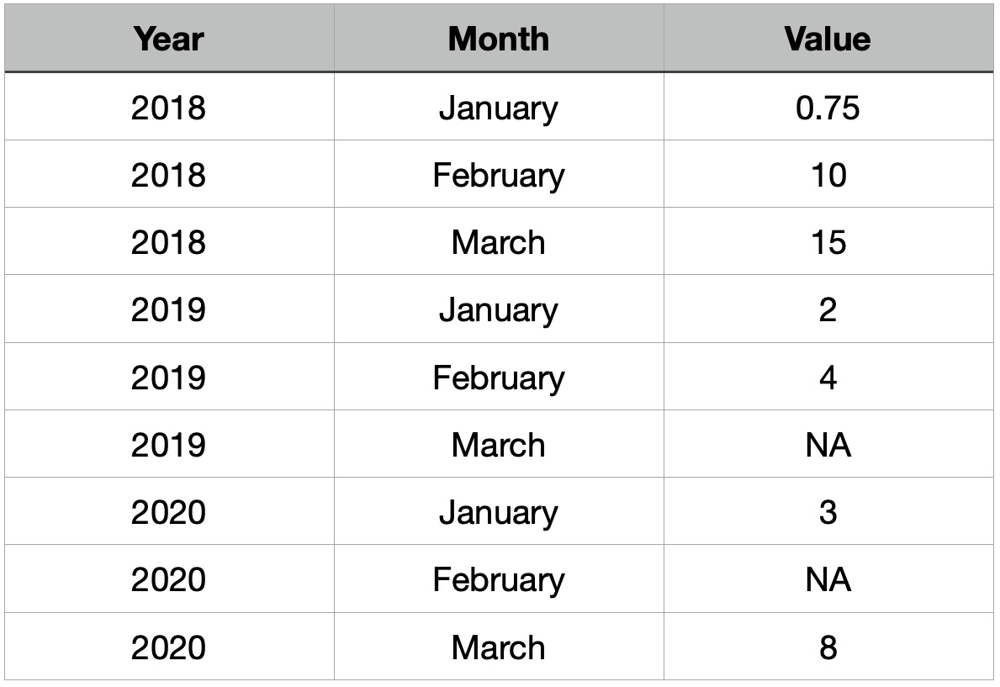

There's an old saying (at least old in data scientist years) that goes, "90% of data science is data wrangling." This rings particularly true for data science leaders, who watch their data scientists spend days painstakingly picking apart ossified corporate datasets or arcane Excel spreadsheets. Does data science really have to be this hard? And why can't they just delegate the job to someone else?

## Data Is More Than Just Numbers

The reason that data wrangling is so difficult is that data is more than text and numbers. As shown in Figure 1, data scientists routinely have to deal with:

- **missing entries**. The phrase "You can't always get what you want" is more than just a rock anthem -- it also applies to data. Not every column or row in a real-world data set will be populated, yet data scientists still have to work with the data.
- **ambiguous values**. Without further information, a data scientist doesn't know if a value of *3/4* is a fraction, a month and a day, or just a string.
- **mixed data types**. People who enter data will sometimes insert comments along with the data which the data scientist then has to separate and exclude to work with the actual data values.

#### Figure 1: Inconsistent ways of entering values impede data understanding.

## It's Not Just The Data; It's the Context

The data challenges listed above are just the tip of the iceberg. Many datasets originate in Excel, and many Excel creators hide information in their column and row names as shown in Figure 2. In other data sets, no metadata is included within the data set at all. Instead data publishers provide a completely separate data dictionary that data scientists have to interpret to use the data.

#### Figure 2: Data only starts to make sense when values have context.

## The Data Wrangling Challenge Has No Easy Solutions

With these challenges facing them, your data scientists are far from wasting time when they are data wrangling. In fact, transforming data is an essential part of the understanding process

However, data science leaders can speed up data wrangling within a team by encouraging some simple behaviors:

1. **Write code to allow reproducibility**. Too many data scientists perform data wrangling using drag-and-drop tools like Excel. That approach may seem faster the first time that data set is ingested, but that manual process will stand in the way of reproducing the analysis later. Instead write functions for ingesting data that can be re-run every time the data changes, and you'll save time in the long run.
2. **Embrace tidy data**. The [*tidyverse* collection of packages in R](https://www.tidyverse.org) establishes a standardized way of storing and manipulating data called *tidy data*, as shown in Figure 3. The tidyverse ensures that all the context needed to understand a data set is made explicit by giving every variable its own column,  every observation its own row, and storing only one value per cell.

3. **Create a standard data ingestion library**. If your entire team defaults to using tidy data and the tidyverse in all their analyses, then they'll find it easier to read and reuse each other's data wrangling code. You can encourage that behavior by establishing a team Github organization where they can share those code packages and speed up their data understanding in future projects.

#### Figure 3: Tidy data makes all context explicit and gives each variable its own column.

These behaviors can yield big rewards for data science teams. At rstudio::conf 2020, Dr. Travis Gerke of Moffitt Cancer Center in Tampa, Florida noted that reproducible pipelines have proved a game-changer in wrangling and unlocking complex patient data for the Center’s researchers.

## Learn More About Reproducibility and Sharing Standard Libraries

If you'd like to learn more about how to reduce data wrangling hassles, we recommend:

- [An rstudio::conf talk by Emily Riederer, an Analytics Manager at Capital One](https://resources.rstudio.com/rstudio-conf-2020/rmarkdown-driven-development-emily-riederer) describes how reproducible programming using RMarkdown can help R users develop better software programming practices. 
- [This recent RStudio webinar on Reproducibility in Production](https://resources.rstudio.com/webinars/reproducibility-in-production) shows you how to write executable R Markdown documents for a production environment.
- [RStudio Package Manager](https://rstudio.com/products/package-manager/) helps you share standard and consistent libraries across your data science team. This professional product empowers R users to access packages and reproduce environments while giving IT control and visibility into package use. 

